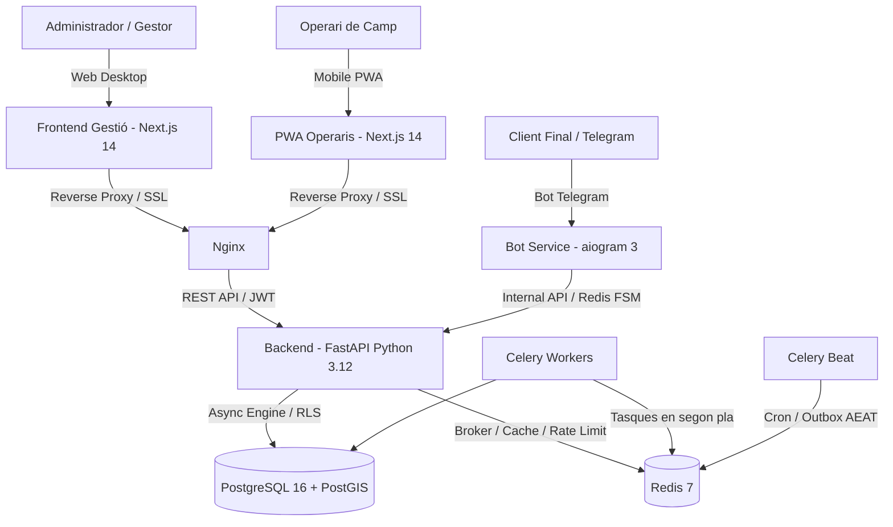

# SEVALOR — Gestió d'Equips i Operacions Multi-Tenant

Plataforma SaaS integral i modular dissenyada per a la gestió avançada d'equips, operacions de camp, magatzem, logística, flota de vehicles, comptabilitat normativa (**Veri\*factu / AEAT**) i suport al client final.

---

## 🚀 Arquitectura del Sistema

SEVALOR està estructurat com una suite de microserveis desacoblats coordinats mitjançant Docker Compose:



---

## 📦 Components i Mòduls

### 1. ⚙️ Backend (`/backend`)
- **Tecnologies**: Python 3.12, FastAPI, SQLAlchemy 2.0 (async), Alembic, Celery, Pydantic v2.
- **Aïllament Multi-Tenant**: Implementat mitjançant **Row-Level Security (RLS)** a nivell de PostgreSQL garantint estricte aïllament de dades per a cada empresa.
- **Mòduls Clau**:
  - `gestio/`: Administració de clients, proveïdors, estoc de magatzem, ordres de picking, incidències i vehicles de flota.
  - `operari_pwa/`: Endpoints optimitzats per a mobilitat (jornades de treball, fitxatges, llistat de feines en temps real).
  - `comptabilitat/`: Emissió de factures d'acord amb la normativa Veri\*factu (cadena de hashes SHA-256 i codi QR) i cua Outbox cap a l'AEAT.
  - `copilot/`: Assistent intel·ligent amb suport d'IA per a consultes i optimització d'operacions.
  - `superadmin/`: Gestió global de tenants, mètriques i telemetria del sistema.

### 2. 📱 PWA Operaris (`/pwa`)
- **Tecnologies**: Next.js 14, React 18, Tailwind CSS, Dexie (IndexedDB), Lucide Icons.
- **Característiques**:
  - Disseny *Mobile-First* concebut per al treball sobre el terreny.
  - Autenticació ràpida mitjançant NIF i PIN numèric per a operaris.
  - Suport per a operacions *Offline-First* sincronitzant dades locals amb Dexie.
  - Control de jornada (inici/pausa/final de torn), picking de materials i report d'incidències amb fotografia.

### 3. 🖥️ Frontend Gestió Desktop (`/frontend`)
- **Tecnologies**: Next.js 14 (App Router), TypeScript, Tailwind CSS, Playwright.
- **Característiques**:
  - Panell d'administració centralitzat d'escriptori.
  - Taules de dades interactives, mapes amb suport GIS i capes per a plànols.
  - Gestió documental, traçabilitat de flota i seguiment de comptabilitat.

### 4. 🤖 Bot de Telegram per a Clients (`/bot`)
- **Tecnologies**: Python 3.12, aiogram 3.x, Redis 7 (FSM i Rate Limiting).
- **Característiques**:
  - Canal directe perquè els clients finals puguin obrir incidències.
  - Validació estricta de fitxers multimèdia (comprovació de *magic bytes* i prevenció de dobles extensions malicioses).
  - Aprovació i consulta d'estat de pressupostos.

### 5. 🗄️ Base de Dades i Migracions (`/db` & `/backend/alembic`)
- PostgreSQL 16 amb l'extensió **PostGIS 3.4** per a geolocalització i delimitació de parcel·les/finques.
- Migracions d'inicialització a `db/migrations/` per a la configuració del model de dades base i polítiques RLS.
- Control de versions d'esquema continu amb Alembic.

---

## 🛠️ Requisits Previs

- [Docker](https://docs.docker.com/get-docker/) (v24+) i [Docker Compose](https://docs.docker.com/compose/) (v2+)
- [Python](https://www.python.org/) 3.12+ (per a desenvolupament local sense contenidors)
- [Node.js](https://nodejs.org/) 20+ i `npm` o `pnpm`

---

## ⚡ Com començar (Desplegament ràpid amb Docker)

1. **Clonar el repositori**:
   ```bash
   git clone https://github.com/MiquelUB/sevalor.git
   cd sevalor
   ```

2. **Configurar les variables d'entorn**:
   ```bash
   cp .env.example .env
   ```
   > ⚠️ Edita el fitxer `.env` i defineix claus segures per a `SECRET_KEY`, `POSTGRES_PASSWORD`, `REDIS_PASSWORD` i el teu token de Telegram si s'utilitza el bot.

3. **Construir i aixecar els serveis**:
   ```bash
   docker compose up -d --build
   ```

4. **Verificar l'estat dels contenidors**:
   ```bash
   docker compose ps
   ```

5. **Aplicar les migracions d'Alembic**:
   ```bash
   docker compose run --rm backend alembic upgrade head
   ```

---

## 🧪 Proves i Validació

### Tests del Backend (Pytest / Zero Mock)
Execució dels tests d'integració i validació dels fluxos complets (RLS, API, Operaris, Copilot):
```bash
docker exec -e TEST_DATABASE_URL="postgresql+asyncpg://postgres:postgres@db:5432/sevalor" \
            -e TESTING="1" \
            sevalor_backend python3 -m pytest tests/ -v
```

### Tests del Frontend / PWA (Playwright)
```bash
cd frontend
npm install
npx playwright test
```

---

## 📁 Estructura del Projecte

```
sevalor/
├── backend/                  # API REST FastAPI, SQLAlchemy, Alembic, Celery
│   ├── alembic/              # Control de migracions de BD
│   ├── app/
│   │   ├── api/v1/           # Rutes de l'API (gestió, pwa, superadmin, copilot)
│   │   ├── core/             # Configuració, seguretat, middleware RLS
│   │   ├── models/           # Models SQLAlchemy
│   │   ├── services/         # Lògica de negoci (Veri*factu, Outbox AEAT, etc.)
│   │   └── workers/          # Tasques asíncrones de Celery
│   └── tests/                # Bateria de proves unitàries i d'integració
├── bot/                      # Microservei bot de Telegram (aiogram 3)
├── db/
│   └── migrations/           # Scripts SQL d'esquema i polítiques RLS inicials
├── frontend/                 # Aplicació web d'administració (Next.js 14 Desktop)
├── infra/                    # Configuracions de Nginx, SSL i desplegament
├── pwa/                      # Aplicació mòbil d'operaris (Next.js 14 + Dexie)
├── sdd_sevalor/              # Especificacions funcionals (Specs 001-024) i històric
├── docker-compose.yml        # Orquestració dels 7 serveis
└── .env.example              # Plantilla de configuració de l'entorn
```

---

## 🔒 Seguretat i Bones Pràctiques

- **Zero Hardcoded Secrets**: Totes les credencials, secrets criptogràfics i claus API es carreguen exclusivament des de variables d'entorn. Els fitxers `.env` reals mai no es versionen a Git.
- **Row-Level Security (RLS)**: Cada consulta a la base de dades s'executa amb el context del `tenant_id` actiu, impedint qualsevol fuita de dades entre organitzacions.
- **Sanitització de fitxers**: Els punts d'entrada d'arxius verifiquen signatura de bytes reals i eliminen riscos de dobles extensions o payloads executables.
