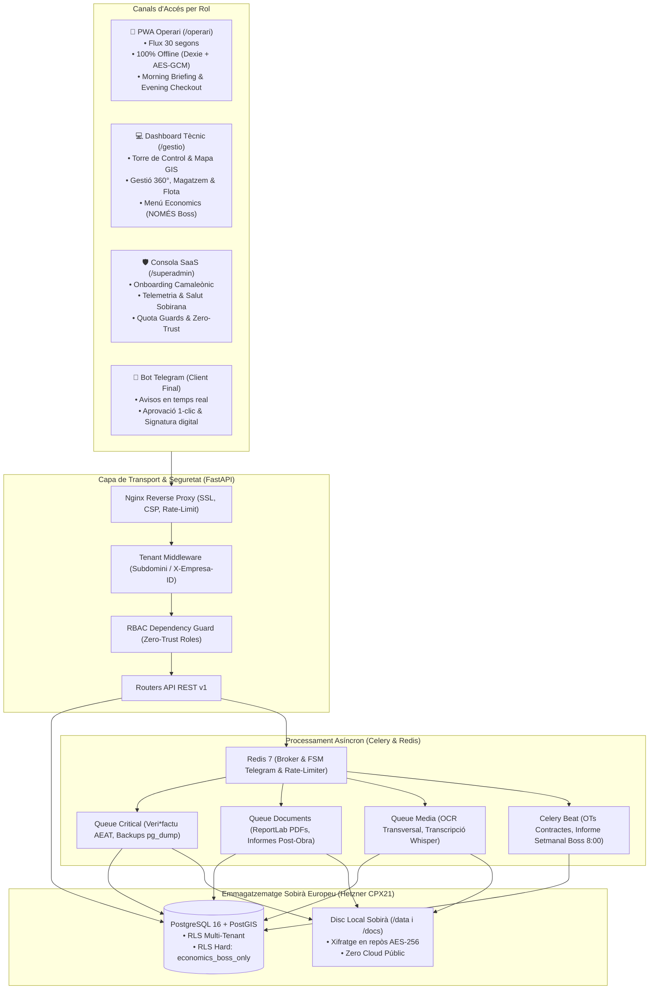
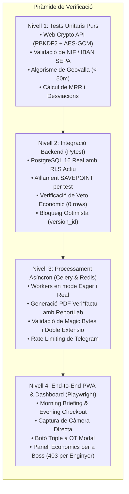

# Pla Mestre d'Arquitectura i Consolidació Tècnica: Sevalor Suite (v4.0)

> **Document:** `plan.md`  
> **Estat:** Ratificat per a Desenvolupament (Post-Neteja de Deute Tècnic)  
> **Norma Suprema:** Constitució del Projecte v4.0 & Macro-Especificacions (01 a 05)  
> **Principi Metodològic:** *Sense codi de pedaç; arquitectura neta, modelat sòlid i desenvolupament guiat per especificacions (SDD).*

---

## 1. Visió del Sistema i Objectius de Consolidació

**Sevalor Suite** és una plataforma ERP/Field Service multi-inquilí i multi-vertical (*CampoPro*, *ElectricPro*, *HydroPro*, *BuildingPro*, *ClimaPro*) dissenyada per a empreses d'instal·lacions i serveis tècnics amb operaris al terreny.

Aquest pla defineix la reorganització completa del sistema un cop eliminats els 42 scripts solts i la brossa de pegats. Estableix com s'estructuren els mòduls, com s'organitza la base de dades aïllada per RLS, quines decisions d'enginyeria s'han adoptat i quina és l'estratègia de proves per garantir un compliment del 100% de les especificacions i de la Constitució.



---

## 2. Mòduls del Sistema i Cobertura de Requisits Funcionals

El sistema s'organitza en **5 grans dominis modulars** que reflecteixen fidelment les macro-especificacions del projecte:

### 2.1 Mòdul de Backoffice de Gestió (`/gestio`)
Responsable de l'operativa administrativa, logística i d'enginyeria tècnica.
- **Torre de Control & Mapa Operatiu**: Visualització cartogràfica d'intervencions actives amb coordenades reals (adreces geocodificades), gestió d'estats d'OT i reassignació "Drop & Go".
- **Gestió 360° d'Operaris i Control Horari**: Fitxa integral del treballador, calendari de torns, custòdia d'eines assignades i control horari fefaent amb registre de coordenades GPS (sense tancament brusc a les 8 hores).
- **Magatzem, Mermes i Codis de Barres**: Traçabilitat exclusiva mitjançant codis de barres (EAN, Code128) amb exclusió explícita de codis QR per a eines o peces. Gestió de consum amb % de merma en materials continus (tubs, cables) i generació d'esborranys de comanda de reposició quan l'estoc baixa del límit de seguretat (HITL: cap correu s'envia sense aprovació humana).
- **Flota i Manteniments**: Gestió de permisos de conducció requerits per vehicle (bloqueig d'assignació d'operaris sense llicència adequada), historial de tallers, ITV, assegurances i seguiment per càmera d'odòmetre.
- **Edició GIS de Plànols No Destructiva**: Visualitzador i gestor de capes vectorials d'anotació sense modificar en cap cas el PDF base original.
- **Menú Economics Exclusiu (NOMÉS Boss)**: Tauler financer segregat amb indicadors de rendibilitat empresarial: marge brut per feina, EBITDA, MRR de contractes, previsió de tresoreria a 30/60/90 dies i factures impagades (>30 i >90 dies).
- **Formulari OT amb Botó Triple**: Interfície de nova comanda amb tres opcions clarament diferenciades: `[Generar Tasca]`, `[Generar Pressupost]` i `[✨ Pressupost Intel·ligent (Copilot)]`.

### 2.2 Mòdul de Frontline d'Operaris (`/operari`)
PWA mòbil d'alta eficiència dissenyada per a l'ús a peu d'obra.
- **Morning Briefing Seqüencial**: Flux guiat d'obertura de jornada: Login offline (DNI + PIN de 4 dígits) -> Captura d'odòmetre i checklist del vehicle -> Resum de la tasca assignada -> Picking guiat d'entrada (Pick In).
- **Execució amb Control de Qualitat 3-Fases**: Obligatorietat d'aportar 3 fotografies tècniques preses directament des de la càmera del dispositiu (Abans, Durant i Després). Prohibició d'importar fotos des de la galeria per evitar fraus. Bloqueig incondicional del tancament de la feina si manca alguna de les tres fotos.
- **Evening Checkout Guiat**: Flux guiat de finalització: Picking de sortida dels materials sobrants (Pick Out) cap a nau -> Foto final d'odòmetre -> Confirmació de custòdia de tiquets de despesa físics -> Fitxatge de sortida amb coordenades GPS.
- **Cicle d'Incidències Vermell-Verd**: Registre immediat en 30 segons mitjançant nota de veu i foto. Estat inicial bloquejant (Vermell) fins a resolució tècnica o aprovació d'extra (Verd).
- **Tiquets de Despesa Sense Tecleig**: Fotografia del rebut físic, selecció de categoria i generació automàtica de flag d'aprovació si l'import supera els 100 €.
- **Eines Auxiliars de Camp**: Llanterna integrada contínua per a inspecció en fossats o espais foscos, compressió client-side WebP (< 1 MB) i exportació de plànols anotats com a imatge adjunta a incidències.

### 2.3 Mòdul de Core IA, OCR, Bot de Telegram & Processament Asíncron
Nucli d'automatització, visió artificial i comunicació externa.
- **Alta Màgica OCR Transversal (Zero Data Entry)**: Pipeline unificat per digitalitzar fotografies i documents PDF (DNI per a altes d'operaris, fitxes tècniques de vehicles, albarans de material, factures de compra i contractes), extraient informació estructurada en un esborrany transitori per a confirmació humana (HITL).
- **Peritatge Multimodal d'Incidències**: Transcripció fonètica d'àudio via model Whisper local + anàlisi visual de patrons de fallada -> Redacció del Memoràndum Tècnic d'Incidència proposant "Extra Facturable" o "Cost Intern".
- **Bot de Telegram per a Clients**: Canal interactiu sense aplicació mòbil per a clients finals. Accés governat per deep-linking d'un sol ús (rebuig opac d'usuaris no autoritzats), avisos d'arribada d'operaris, aprovació de pressupostos a 1 clic (`[Acceptar]` / `[Demanar Canvis]`) i signatura digital de conformitat post-obra.
- **Memòria Històrica 360° i Auditoria de Garanties**: Reconciliació automàtica de components instal·lats amb alertes de garantia de fabricant (2-3 anys) i garantia de mà d'obra corporativa (3 mesos a cost 0 €).
- **Facturació Legal Veri\*factu (RD 1007/2023)**: Cicle complet Pre-factura (HITL) -> Factura inalterable amb codi QR tributari, encadenament SHA-256 amb bloqueig pessimista (`SELECT FOR UPDATE`), despatx asíncron Outbox i emissió de factures rectificatives.
- **Copilot RAG Aïllat per Vertical amb Aprenentatge Progressiu**: Assistència en llenguatge natural contextualitzada exclusivament a la normativa de la vertical de l'empresa. Evolució progressiva segons històric acumulat i informe executiu setmanal per al Boss els dilluns a les 8:00 AM.
- **Barrera de Seguretat Doble Capa del Copilot**:
  - *Capa 1 (Soft)*: Classificador IA que intercepta consultes econòmiques segons el rol de l'usuari.
  - *Capa 2 (Hard)*: Política RLS a PostgreSQL `economics_boss_only` que retorna 0 files davant de qualsevol consulta que no provingui del rol Boss.

### 2.4 Mòdul d'Infraestructura Sobirana & Governança Superadmin (`/superadmin`)
Consola de control global per al propietari de la plataforma SaaS.
- **Assistent d'Onboarding amb Marca Camaleònica**: Alta d'empreses amb validació algorísmica de NIF espanyol, disponibilitat de subdomini, selecció de vertical i definició de paleta cromàtica (Primary, Secondary, Accent) injectada com a tokens CSS HSL a la PWA, Dashboard, PDFs i missatges. Emissió d'enllaç d'activació segur (24 h) per al compte arrel de gerència.
- **Segregació Zero-Trust**: Bloqueig estructural que impedeix al Superadministrador visualitzar dades privades dels clients (feines, albarans, factures, fotos o xats), limitant-se a mètriques operatives agregades.
- **Torre de Control de Salut**: Telemetria en temps real sobre disponibilitat global, latències percentils (p95), volum de sessions actives (camp vs. oficina) i estat dels subsistemes.
- **Governança del Cicle de Vida i Quota Guard**: Transicions d'estat (Trial 14 dies, Actiu, Suspès per Impagament, Manteniment, Baixa). Protecció de downgrade que impedeix reduir el pla de llicència si el nombre d'operaris actius supera el nou límit.
- **Baixa Certificada i Certificat de Destrucció**: Descàrrega íntegra d'actius en un període de custòdia de 30 dies, purga irreversible de registres i emissió del Certificat de Destrucció de Dades amb segell criptogràfic custodiat durant 5 anys.

### 2.5 Mòdul de Contractes de Manteniment Recurrent (Spec 05)
Gestió d'ingressos predictibles i manteniments obligatoris.
- **Alta i Gestió de Contractes**: Vinculació a client i finques, configuració de periodicitat (mensual, trimestral, semestral, anual), preus pactats i serveis coberts.
- **Generació Automàtica d'OTs Preventives**: Tasca programada a Celery Beat que anticipa i crea les ordres de treball al calendari d'obres amb la descripció i materials habituals.
- **Alertes de Venciment**: Notificacions visuals a 15, 5 i 1 dia abans de la revisió, i alertes crítiques en cas de manteniment vençut sense executar.
- **Renovació Tàcita i Gestió de Baixes**: Actualització d'imports per percentatge d'increment o valor fix, o cancel·lació amb registre formal del motiu.
- **Càlcul de MRR**: Ingressos recurrents mensuals consolidats (`MRR = Suma(Contractes Actius) / 12`) exposats al menú Economics del Boss.

---

### Taula de Matriu de Traçabilitat de Requisits Funcionals

| Mòdul del Sistema | Components i Rutes | Requisits Funcionals Coberts |
| :--- | :--- | :--- |
| **Backoffice Gestió** | `/gestio/mapa`, `/gestio/feines`, `/gestio/operaris`, `/gestio/magatzem`, `/gestio/flota`, `/gestio/planols`, `/gestio/comptabilitat`, `/gestio/configuracio` | **Const.:** I, II, IV, VI, VII, VIII, X<br/>**Spec 01:** FR-001 fins a FR-018 |
| **Frontline Operaris** | `/operari/login`, `/operari/feines`, `/operari/material`, `/operari/vehicles`, `/operari/incidencies`, `/operari/tiquets`, `/operari/planols` | **Const.:** I, III, IV, IX, X<br/>**Spec 02:** FR-001 fins a FR-014 |
| **Core IA, OCR & Async** | `/gestio/copilot`, Cues Celery (`critical`, `documents`, `media`, `periodic`), Microservei Bot Telegram (`bot/*`), Serveis Veri\*factu i Whisper | **Const.:** I, II, IV, V, VI, VII, IX, X<br/>**Spec 03:** FR-001 fins a FR-013 |
| **Infraestructura Sobirana** | `/superadmin/tenants`, `/superadmin/telemetria`, Middleware Tenant, Desplegament Hetzner Docker Compose | **Const.:** I, VI, VIII, IX, X<br/>**Spec 04:** FR-001 fins a FR-019 |
| **Contractes Manteniment** | `/gestio/contractes`, Càlcul MRR Economics, Planificador Celery Beat OTs preventives | **Const.:** I, IV, VII, X<br/>**Spec 05:** FR-001 fins a FR-009 |

---

## 3. Model de Dades Integral (SQLAlchemy 2.0 & PostgreSQL 16)

Totes les taules de negoci incorporen les columnes auditables `id` (UUIDv4), `empresa_id` (UUIDv4 vinculat a RLS), `created_at` (TIMESTAMPTZ) i `updated_at` (TIMESTAMPTZ).

### 3.1 Diagrama Entitat-Relació Complet

```mermaid
erDiagram
    EMPRESES ||--o{ USUARIS : "te"
    EMPRESES ||--o{ CLIENTS : "gestiona"
    EMPRESES ||--o{ PROVEIDORS : "contracta"
    EMPRESES ||--o{ VEHICLES : "posseeix"
    EMPRESES ||--o{ ARTICLES : "emmagatzema"
    EMPRESES ||--o{ ORDRES_TREBALL : "planifica"
    EMPRESES ||--o{ CONTRACTES_MANTENIMENT : "subscriu"
    EMPRESES ||--o{ FACTURES_CAPCALERA : "emet"

    CLIENTS ||--o{ FINQUES : "posseeix"
    CLIENTS ||--o{ CONTRACTES_MANTENIMENT : "signa"
    CLIENTS ||--o{ ORDRES_TREBALL : "sol·licita"
    CLIENTS ||--o{ FACTURES_CAPCALERA : "rep"
    CLIENTS ||--o{ PREFACTURES : "valida"

    FINQUES ||--o{ ORDRES_TREBALL : "localitza"
    FINQUES ||--o{ CONTRACTES_MANTENIMENT_FINQUES : "inclou"

    CONTRACTES_MANTENIMENT ||--o{ CONTRACTES_MANTENIMENT_FINQUES : "assigna"
    CONTRACTES_MANTENIMENT ||--o{ ORDRES_TREBALL : "genera_preventives"
    CONTRACTES_MANTENIMENT ||--o{ REVISIONS_CONTRACTE : "programa"

    ORDRES_TREBALL ||--o{ INCIDENCIES : "genera"
    ORDRES_TREBALL ||--o{ FULLES_PICKING : "requereix"
    ORDRES_TREBALL ||--o{ PRESSUPOSTOS : "vincula"
    ORDRES_TREBALL ||--o{ CAPES_ANOTACIO_PLANOL : "traça"
    ORDRES_TREBALL ||--o{ PREFACTURES : "origina"

    PRESSUPOSTOS ||--o{ PARTIDES_PRESSUPOST : "desglossa"

    PREFACTURES ||--o{ PREFACTURA_LINIES : "desglossa"
    PREFACTURES ||--o| FACTURES_CAPCALERA : "consolida_a"

    FACTURES_CAPCALERA ||--o{ FACTURES_LINIES : "detalla"
    FACTURES_CAPCALERA ||--o{ OUTBOX_ENVIAMENT_AEAT : "despatxa"

    ARTICLES ||--o{ ESTOCS_MAGATZEM : "te_estoc"
    MAGATZEMS ||--o{ ESTOCS_MAGATZEM : "allotja"
    ARTICLES ||--o{ MOVIMENTS_ESTOC : "registra"
    FULLES_PICKING ||--o{ LINIES_PICKING : "conte"
    ARTICLES ||--o{ LINIES_PICKING : "assigna"

    VEHICLES ||--o{ HISTORIAL_ASSIGNACIONS : "assignat_a"
    VEHICLES ||--o{ TIQUETS_COMBUSTIBLE : "consumeix"
    VEHICLES ||--o{ DOCUMENTS_FLOTA : "custodia"

    PROVEIDORS ||--o{ ALBARANS_PROVEIDOR : "emet"
    PROVEIDORS ||--o{ FACTURES_PROVEIDOR : "cobra"
    ALBARANS_PROVEIDOR ||--o{ FACTURES_PROVEIDOR_LINIES : "origina"

    USUARIS ||--o{ REGISTRES_JORNADA_LABORAL : "fitxa"
    USUARIS ||--o{ EINES_CUSTODIA : "custodia"

    CARPETES_PLANOLS ||--o{ PLANOLS_BASE : "organitza"
    PLANOLS_BASE ||--o{ CAPES_VECTORIALS : "superposa"
    PLANOLS_BASE ||--o{ PINS_INCIDENCIA_PLANOL : "geolocalitza"
```



---

### 3.2 Catàleg d'Entitats i Esquemes de Dades

#### Domini d'Empresa i Administració
1. **`empreses`** (Tenant corporatiu):
   - `id` (UUID, PK), `nom` (VARCHAR 100), `nif` (VARCHAR 20, UNIQUE), `subdomini` (VARCHAR 63, UNIQUE).
   - Identitat Camaleònica: `primari_hsl` (VARCHAR 30), `secundari_hsl` (VARCHAR 30), `accent_hsl` (VARCHAR 30), `logotip_path` (VARCHAR 500), `favicon_path` (VARCHAR 500).
   - Governança SaaS: `pla_subscripcio` (STARTER, PRO, ENTERPRISE), `estat_pagament` (TRIAL, ACTIU, SUSPES_PAGAMENT, MANTENIMENT, BAIXA_OFFBOARDING), `data_onboarding` (TIMESTAMPTZ), `quota_disc_bytes_autoritzada` (BIGINT), `quota_disc_bytes_utilitzada` (BIGINT).
   - Vertical & Feature Flags: `vertical` (VARCHAR 100), `feature_copilot_ia` (BOOL), `feature_flota` (BOOL), `feature_planols` (BOOL), `feature_telegram` (BOOL).
   - Credencials Integrades: `telegram_bot_token` (VARCHAR 255), `telegram_webhook_secret` (VARCHAR 255), `node_ia_url` (VARCHAR 255).
2. **`usuaris`** (Treballadors i Administradors):
   - `id` (UUID, PK), `empresa_id` (UUID, FK `empreses.id`), `nif` (VARCHAR 20), `nom` (VARCHAR 100), `cognoms` (VARCHAR 100), `email` (VARCHAR 200), `telefon` (VARCHAR 20).
   - Autenticació: `password_hash` (VARCHAR 255), `pin_hash` (VARCHAR 255, bcrypt de 4 dígits), `rol` (SUPERADMIN, BOSS, SECRETARIA, ENGINYER, OPERARI, CAP_DE_COLLA).
   - Estat de Seguretat: `estat` (ACTIU, SUSPES, BAIXA), `intents_pin_fallits` (INT), `pin_bloquejat` (BOOL), `secret_2fa` (VARCHAR 64), `totp_activat` (BOOL).
   - Qualificació Operativa: `especialitat` (VARCHAR 50), `cost_hora_eur` (NUMERIC 8,2), `carnet_conduir` (VARCHAR 20: B, C, C1+E, etc.), `carnet_caducitat` (DATE), `prl_certificat_vigencia` (DATE).
3. **`registres_jornada_laboral`** (Control Horari Fefaent):
   - `id` (UUID, PK), `empresa_id` (UUID, FK), `usuari_id` (UUID, FK), `data_jornada` (DATE), `hora_inici` (TIMESTAMPTZ), `hora_fi` (TIMESTAMPTZ, nullable).
   - Geolocalització Obligatòria: `geolocalitzacio_inici` (VARCHAR 100, "lat,lng"), `geolocalitzacio_fi` (VARCHAR 100, "lat,lng").
   - Hores & Incidències: `hores_ordinaries` (NUMERIC 5,2), `hores_extraordinaries` (NUMERIC 5,2), `estat` (EN_CURS, COMPLERT, INCIDENCIA), `motiu_incidencia` (TEXT), `version_id` (INT per a bloqueig optimista).

#### Domini Comercial, Clients i Contractes
4. **`clients`** (Fitxa 360° del Client):
   - `id` (UUID, PK), `empresa_id` (UUID, FK), `rao_social` (VARCHAR 150), `nif` (VARCHAR 20), `adreca` (VARCHAR 255), `telefon` (VARCHAR 20), `email` (VARCHAR 200).
   - Financer: `iban` (VARCHAR 34), `mandat_sepa_signat` (BOOL), `dies_venciment_factura` (INT, default 30).
5. **`finques`** (Centres de Treball o Parcel·les):
   - `id` (UUID, PK), `empresa_id` (UUID, FK), `client_id` (UUID, FK), `nom` (VARCHAR 100), `adreca` (VARCHAR 255), `coordenades_gps` (VARCHAR 100), `persona_contacte` (VARCHAR 100), `telefon_contacte` (VARCHAR 20).
6. **`contractes_manteniment`** (Spec 05 - Ingressos Recurrents):
   - `id` (UUID, PK), `empresa_id` (UUID, FK), `client_id` (UUID, FK), `codi_contracte` (VARCHAR 30, UNIQUE per empresa), `titol` (VARCHAR 200).
   - Condicions Econòmiques: `import_anual_pactat` (NUMERIC 12,2), `periodicitat` (MENSUAL, TRIMESTRAL, SEMESTRAL, ANUAL), `data_inici` (DATE), `data_fi` (DATE).
   - Cicle de Vida: `estat` (ACTIU, SUSPES, FINALITZAT, BAIXA), `renovacio_tacita` (BOOL), `increment_renovacio_percent` (NUMERIC 5,2), `motiu_baixa` (TEXT).
   - Serveis Coberts: `descripcio_serveis` (TEXT), `materials_inclosos` (BOOL), `hores_boss_incloses` (NUMERIC 6,2).
7. **`contractes_manteniment_finques`** (Taula Associativa Contracte-Finques):
   - `contracte_id` (UUID, FK), `finca_id` (UUID, FK), `notes_especifiques` (TEXT). PK composta.
8. **`revisions_contracte`** (Calendari Preventiu):
   - `id` (UUID, PK), `contracte_id` (UUID, FK), `data_planificada` (DATE), `estat` (PROGRAMADA, OT_GENERADA, EXECUTADA, REVISION_VENÇUDA), `ordre_treball_id` (UUID, FK nullable).

#### Domini d'Execució d'Obres i Qualitat de Camp
9. **`ordres_treball`** (Ordres de Treball de Camp):
   - `id` (UUID, PK), `empresa_id` (UUID, FK), `codi` (VARCHAR 30, UNIQUE per tenant), `titol` (VARCHAR 200), `descripcio` (TEXT).
   - Vincles: `client_id` (UUID, FK), `finca_id` (UUID, FK nullable), `contracte_id` (UUID, FK nullable), `cap_de_colla_id` (UUID, FK).
   - Localització Estricta: `adreca` (VARCHAR 255), `lat` (FLOAT nullable), `lng` (FLOAT nullable).
   - Estat Operatiu: `estat` (PENDENT, EN_TRAJECTE, EN_CURS, BLOQUEJADA, FINALITZADA, CONCILIADA).
   - Programació & Concurrència: `data_planificacio` (DATE), `hora_inici_prevista` (TIMESTAMPTZ nullable), `hora_fi_prevista` (TIMESTAMPTZ nullable), `version_id` (INT per a Optimistic Locking).
   - Protocol de Qualitat 3-Fases: `foto_abans_path` (VARCHAR 500), `foto_durant_path` (VARCHAR 500), `foto_despres_path` (VARCHAR 500), `qualitat_verificada` (BOOL, default FALSE).
10. **`incidencies`** (Cicle Vermell-Verd):
    - `id` (UUID, PK), `empresa_id` (UUID, FK), `ordre_treball_id` (UUID, FK nullable), `vehicle_id` (UUID, FK nullable), `operari_id` (UUID, FK).
    - Tipus & Estat: `ambit` (CAMP, VEHICLE, MATERIAL, SEGURETAT), `estat` (VERMELL, VERD), `prioritat` (URGENT, NORMAL).
    - Dades Multimèdia Reals: `audio_path` (VARCHAR 500 nullable), `transcripcio_audio` (TEXT nullable), `foto_path` (VARCHAR 500 nullable), `text_observacions` (TEXT).
    - Resolució: `resolt_per_usuari_id` (UUID, FK nullable), `data_resolucio` (TIMESTAMPTZ nullable), `motiu_tancament` (TEXT nullable).

#### Domini de Logística i Magatzem
11. **`articles`** (Catàleg de Materials i Eines):
    - `id` (UUID, PK), `empresa_id` (UUID, FK), `referencia_inventari` (VARCHAR 50, UNIQUE per empresa), `nom` (VARCHAR 150), `unitat_mesura` (UNITAT, METRE, METRE_QUADRAT, LITRE, KG), `familia` (VARCHAR 50).
    - Traçabilitat: `codi_barres_ean` (VARCHAR 50 nullable), `codi_barres_128` (VARCHAR 50 nullable). Prohibit ús de QR interns.
    - Condicions Econòmiques & Mermes: `estoc_optim` (NUMERIC 10,2), `estoc_minim` (NUMERIC 10,2), `permet_merma` (BOOL), `percentatge_merma_defecte` (NUMERIC 5,2), `preu_cost` (NUMERIC 10,2), `preu_venda` (NUMERIC 10,2).
12. **`magatzems`** i **`estocs_magatzem`**:
    - `magatzems`: `id` (UUID, PK), `empresa_id` (UUID, FK), `nom` (VARCHAR 100), `adreca` (VARCHAR 255), `es_nau_central` (BOOL).
    - `estocs_magatzem`: `id` (UUID, PK), `magatzem_id` (UUID, FK), `article_id` (UUID, FK), `quantitat_fisica` (NUMERIC 10,2), `quantitat_reservada` (NUMERIC 10,2), `ubicacio_passadis` (VARCHAR 50).
13. **`fulles_picking`** i **`linies_picking`** (Morning Pick In & Evening Pick Out):
    - `fulles_picking`: `id` (UUID, PK), `ordre_treball_id` (UUID, FK), `vehicle_id` (UUID, FK nullable), `estat` (PENDENT, CARREGAT_PICK_IN, RETORNAT_PICK_OUT, CONCILIAT).
    - `linies_picking`: `id` (UUID, PK), `fulla_picking_id` (UUID, FK), `article_id` (UUID, FK), `quantitat_prevista` (NUMERIC 10,2), `quantitat_carregada_pick_in` (NUMERIC 10,2), `quantitat_retornada_pick_out` (NUMERIC 10,2), `merma_declarada` (NUMERIC 10,2).
14. **`eines_custodia`** (Parc d'Eines i Maquinària Manual):
    - `id` (UUID, PK), `empresa_id` (UUID, FK), `referencia_fabricant` (VARCHAR 100), `nom` (VARCHAR 150), `numero_serie` (VARCHAR 100, UNIQUE per fabricant), `usuari_custodia_id` (UUID, FK nullable), `estat` (DISPONIBLE, ASSIGNADA, REPARACIO, BAIXA), `data_fi_garantia` (DATE).

#### Domini de Flota i Mobilitat
15. **`vehicles`** (Parc Mòbil):
    - `id` (UUID, PK), `empresa_id` (UUID, FK), `matricula` (VARCHAR 20, UNIQUE), `marca` (VARCHAR 50), `model` (VARCHAR 50), `tipus` (FURGONETA, CAMIO, 4X4, TURISME).
    - Requisit Viari Estricte: `carnet_requerit` (VARCHAR 20: B, C, C1+E). Bloqueig d'assignació a operaris sense aquest permís.
    - Manteniment & Estat: `odometre_actual` (INT), `data_proxima_itv` (DATE), `estat` (DISPONIBLE, ASSIGNAT, TALLER, GRUA, BAIXA).
16. **`documents_flota`** (Expedient Documental del Vehicle):
    - `id` (UUID, PK), `vehicle_id` (UUID, FK), `tipus_document` (ITV, ASSEGURANCA, REPARACIO, CONTRACTE_RENTING, FITXA_TECNICA), `nom_arxiu` (VARCHAR 255), `fitxer_path` (VARCHAR 500), `data_caducitat` (DATE nullable).
17. **`tiquets_combustible`** (Despesa de Camp):
    - `id` (UUID, PK), `empresa_id` (UUID, FK), `vehicle_id` (UUID, FK nullable), `operari_id` (UUID, FK), `import_euros` (NUMERIC 8,2), `litres` (NUMERIC 6,2), `foto_tiquet_path` (VARCHAR 500), `requereix_aprovacio` (BOOL, true si import > 100 €), `custodia_paper_confirmada` (BOOL).

#### Domini Financer, Pre-Facturació i Veri\*factu
18. **`pressupostos`** i **`partides_pressupost`**:
    - `pressupostos`: `id` (UUID, PK), `empresa_id` (UUID, FK), `client_id` (UUID, FK), `ordre_treball_id` (UUID, FK nullable), `codi` (VARCHAR 30), `origen` (MANUAL, COPILOT_IA), `total_pressupostat` (NUMERIC 12,2), `estat` (ESBORRANY, ENVIAT_TELEGRAM, ACCEPTAT, REBUTJAT).
    - `partides_pressupost`: `id` (UUID, PK), `pressupost_id` (UUID, FK), `concepte` (VARCHAR 255), `quantitat` (NUMERIC 10,2), `preu_unitari` (NUMERIC 10,2), `subtotal` (NUMERIC 10,2).
19. **`prefactures`** (Estat Transitori HITL Obligatori):
    - `id` (UUID, PK), `empresa_id` (UUID, FK), `ordre_treball_id` (UUID, FK nullable), `client_id` (UUID, FK), `codi_prefactura` (VARCHAR 30), `base_imposable` (NUMERIC 12,2), `iva_total` (NUMERIC 12,2), `total_prefactura` (NUMERIC 12,2), `estat` (PENDENT_REVISIO, REVISAT_HUMA, VALIDAT_PER_FACTURA, REBUTJAT).
20. **`factures_capcalera`** i **`factures_linies`** (Facturació Legal Inalterable):
    - `factures_capcalera`: `id` (UUID, PK), `empresa_id` (UUID, FK), `prefactura_origen_id` (UUID, FK nullable), `numero_factura` (INT), `serie` (VARCHAR 20), `es_rectificativa` (BOOL, default FALSE), `factura_rectificada_id` (UUID, FK nullable).
    - Criptografia Veri\*factu: `hash_sha256` (CHAR 64, UNIQUE), `hash_anterior` (CHAR 64 nullable), `qr_data` (TEXT), `pdf_path` (VARCHAR 500).
    - Imports: `base_imposable` (NUMERIC 12,2), `quota_iva` (NUMERIC 12,2), `liquid_exigible` (NUMERIC 12,2), `estat_cobrament` (PENDENT, COBRADA, IMPAGADA, VENÇUDA).
21. **`outbox_aeat`** (Patró Outbox per a Despatx Telemàtic AEAT):
    - `id` (UUID, PK), `empresa_id` (UUID, FK), `factura_id` (UUID, FK), `payload_xml` (TEXT), `intents` (INT), `estat` (PENDENT, ENVIAT_CORRECTE, ERROR_REINTENT), `darrer_error` (TEXT).

---

### 3.3 Polítiques de Seguretat RLS (Row Level Security) a PostgreSQL

Totes les connexions del Backend a la BD s'estableixen mitjançant el rol d'aplicació `sevalor_app`. La seguretat s'aplica en dues capes infranquejables a nivell de motor PostgreSQL:

#### 1. Aïllament Multi-Inquilí Estricte (Capa General)
Per a totes les taules de l'aplicació, s'activa Row Level Security i s'aplica la política de tenant:
```sql
ALTER TABLE clients ENABLE ROW LEVEL SECURITY;
CREATE POLICY tenant_isolation_clients ON clients
    FOR ALL
    USING (empresa_id = NULLIF(current_setting('app.current_empresa_id', true), '')::uuid);
```
*(Es replica exactament per a `ordres_treball`, `vehicles`, `articles`, `magatzems`, `contractes_manteniment`, `prefactures`, etc.)*

#### 2. Barrera Econòmica Doble Capa: Política RLS `economics_boss_only` (Capa Hard)
Per a totes les taules i vistes que contenen informació de marges, sous, facturació i rendibilitat, s'activa la política RLS que bloqueja qualsevol accés si l'usuari no té el rol `BOSS`:
```sql
ALTER TABLE factures_capcalera ENABLE ROW LEVEL SECURITY;
CREATE POLICY economics_boss_only_factures ON factures_capcalera
    FOR ALL
    USING (
        empresa_id = NULLIF(current_setting('app.current_empresa_id', true), '')::uuid
        AND (
            NULLIF(current_setting('app.current_user_role', true), '') = 'BOSS'
            OR NULLIF(current_setting('app.current_user_role', true), '') = 'SUPERADMIN'
        )
    );
```
Si un Enginyer, Secretaria o Operari executa un `SELECT * FROM factures_capcalera` o una consulta a través del Copilot, **PostgreSQL retorna exactament 0 files**, fent impossible la filtració de dades econòmiques per disseny de la base de dades.

---

## 4. Decisions d'Arquitectura Justificades

A continuació es detallen les 10 decisions estructurals clau del projecte, la seva justificació tècnica i l'alternativa que ha estat descartada expressament:

### D-01: Row Level Security (RLS) a PostgreSQL vs. Filtració a Capa d'Aplicació (ORM `where`)
- **Decisió adoptada**: Activar RLS obligatòriament a totes les taules de la base de dades utilitzant variables de sessió PostgreSQL (`app.current_empresa_id` i `app.current_user_role`).
- **Justificació**: Garanteix l'aïllament multi-inquilí i la protecció de dades a nivell de motor de BD. Si un desenvolupador oblida un filtre `where(Model.empresa_id == ...)` a FastAPI o un endpoint d'un nou mòdul pateix una fallada lògica, PostgreSQL bloca automàticament qualsevol filtració entre clients o rols.
- **Alternativa descartada**: Confiar exclusivament en filtres del framework a la capa Python (SQLAlchemy ORM). Descartada per l'elevat risc d'error humà o efectes col·laterals en consultes complexes o noves funcionalitats ràpides.

### D-02: Doble Capa de Seguretat Econòmica (Classificador IA + RLS) vs. Llista Negra de Paraules Clau
- **Decisió adoptada**: Implementar una barrera en dues fases:
  1. *Capa 1 (Soft)*: Prompt estructurat i classificador d'intenció al Copilot que detecta si la consulta requereix dades econòmiques/financeres i comprova el rol abans d'invocar qualsevol eina (Tool Calling).
  2. *Capa 2 (Hard)*: Política PostgreSQL RLS `economics_boss_only` sobre les taules financeres.
- **Justificació**: Inviolabilitat matemàtica. Fins i tot si un atac de "Jailbreak" o enginyeria inversa al prompt de la IA aconsegueix bypassar la Capa 1, la crida SQL a la BD retornarà 0 registres.
- **Alternativa descartada**: Llista d'strings estàtics a Python (`PARAULES_CLAU_FINANCERES_VETO = ['sou', 'salari', ...]`). Descartada per fràgil, fàcil de saltar amb sinònims o preguntes indirectes, i per no oferir cap garantia a nivell de dades.

### D-03: Web Crypto API (AES-GCM derivat de PIN) a IndexedDB vs. JWT en Text Pla a `localStorage`
- **Decisió adoptada**: Els tokens d'accés de camp de l'operari es xifren localment a la PWA mitjançant la Web Crypto API nativa amb AES-GCM de 256 bits, derivant la clau mestra del PIN de 4 dígits de l'operari via PBKDF2 amb sal aleatòria de 32 bytes, desant-se a IndexedDB (Dexie).
- **Justificació**: Compliment del Principi III de la Constitució. Si el telèfon intel·ligent d'un treballador és sostret o extraviat a l'obra, cap atacant pot extreure el JWT de la memòria del navegador sense conèixer el PIN de desbloqueig.
- **Alternativa descartada**: Emmagatzemar el token directament a `localStorage` o a galetes de sessió sense xifrar. Descartada per vulnerabilitat manifesta davant atacs XSS o accés físic al terminal no bloquejat.

### D-04: Captura Reial Multimèdia (MediaRecorder + Càmera Directa) vs. Mocks i Simulacions
- **Decisió adoptada**: Integrar l'API nativa de navegadors `navigator.mediaDevices.getUserMedia` i `MediaRecorder` per a la gravació d'àudio autèntic en format WebM i transmetre'l al model Whisper, i imposar l'atribut `capture="environment"` a l'etiqueta `<input type="file">` per obligar a activar el sensor físic de la càmera a peu d'obra.
- **Justificació**: Respecte estricte al Principi I (Zero Mock Data) i requisits FR-005/FR-006 de l'Spec 02. Evita la manipulació o el frau documental impedint que l'operari seleccioni fotos d'obres anteriors des de la galeria del telèfon.
- **Alternativa descartada**: Funcions simulades com `handleSimularAudio()` que assignaven rutes d'àudio estàtiques inventades (`/docs/audio/incidencia_live.webm`). Descartada per enganyosa i inacceptable en producció.

### D-05: Flux HITL Comercial (Pressupost -> OT -> Pre-factura -> Veri\*factu) vs. Facturació Directa
- **Decisió adoptada**: L'emissió de factures legals Veri\*factu exigeix sempre la generació prèvia d'una **Pre-factura** transitora, calculada automàticament des de les dades de tancament de l'OT (reconciliació de materials reals consumits menys retornats, hores efectives fitxades i tiquets de despesa), la qual ha de ser aprovada conscientment per un humà (Enginyer o Secretaria).
- **Justificació**: Compliment de l'Spec 01 (FR-013) i de la Llei de Facturació Espanyola (RD 1007/2023). Un cop generada la factura amb encadenament SHA-256, és immutable i té efectes tributaris; cap errada o merma d'obra ha de cristal·litzar en factura definitiva sense validació d'un gestor.
- **Alternativa descartada**: Generació i emissió directa de factura automàtica des de la pantalla de l'operari en tancar la tasca. Descartada per risc fiscal inacceptable i pèrdua de control administratiu.

### D-06: Formulari OT amb Botó Triple vs. Creació Única de Feina
- **Decisió adoptada**: La finestra modal de creació de feina disposa obligatòriament de 3 accions diferenciades:
  1. `[Generar Tasca]`: Creació directa d'OT i picking per a execució immediata d'urgències.
  2. `[Generar Pressupost]`: Creació d'esborrany de pressupost manual amb partides de barem.
  3. `[✨ Pressupost Intel·ligent (Copilot)]`: Assistència del Copilot per proposar partides i preus segons l'historial de treballs similars anteriors de l'empresa.
- **Justificació**: Respon al flux real de contractació d'empreses d'instal·lacions (User Story 8, Spec 01), on més del 70% de les actuacions no planificades requereixen aprovació prèvia del client abans de desplaçar la quadrilla.
- **Alternativa descartada**: Un únic botó rígid `Crear Intervenció i Picking` que obligava a crear sempre feines tancades sense possibilitat de pressupostació prèvia.

### D-07: Emmagatzematge Sobirà Local a Hetzner UE vs. AWS S3 o Cloud Públics
- **Decisió adoptada**: Tots els fitxers (fotografies pericials, PDFs d'albarans, plànols vectorials i còpies de seguretat `pg_dump`) es custodien exclusivament a volums locals dedicats del servidor Hetzner a la Unió Europea (`/data/{empresa_id}/` i `/docs/{empresa_id}/`), gestionant l'arbre de carpetes de forma aïllada per tenant.
- **Justificació**: Sobirania digital europea i compliment radical del RGPD (Principi IX de la Constitució). S'evita la transferència internacional de dades confidencials d'obres i clients particulars a servidors sota legislació estrangera (Cloud Act).
- **Alternativa descartada**: Delegar l'allotjament de fitxers en serveis de bucket d'Amazon AWS S3 o Google Cloud Storage. Descartada formalment per la Constitució de Sevalor Suite.

### D-08: Motor Camaleònic per Tokens CSS HSL vs. Compilació Estàtica per Tenant
- **Decisió adoptada**: La identitat corporativa de cada empresa (colors Primari, Secundari i Accent) es desa com a valors HSL a la taula `empreses` i s'injecta en temps d'execució mitjançant variables CSS globals (`--primary`, `--secondary`, `--accent`) a través del proveïdor `ChameleonProvider` de Next.js.
- **Justificació**: Permet suportar milers d'empreses amb una única instància d'aplicació i un sol build de frontend (`npm run build`), transformant instantàniament la PWA, el panell d'oficina i els PDFs generats sense requerir nous desplegaments.
- **Alternativa descartada**: Compilar un paquet de frontend separat o generar fulls d'estil estàtics per a cada empresa. Descartada per ser inescalable i multiplicar els costos de manteniment i desplegament.

### D-09: Identificació Logística Exclusiva per Codis de Barres vs. Codis QR en Eines i Materials
- **Decisió adoptada**: Totes les eines en custòdia i peces d'estoc s'identifiquen exclusivament mitjançant codis de barres clàssics (EAN-13, Code 128) o referència alfanumèrica de fàbrica. Els codis QR queden restringits **únicament i exclusivament** a la facturació tributària oficial Veri\*factu.
- **Justificació**: Principi funcional de sector industrial (Spec 01 FR-007). Les eines i materials manuals de lampisteria, electricitat o climatització pateixen brutícia, fang i desgast físic; els lectors industrials i la visió de camp llegeixen codis de barres amb una taxa d'èxit molt superior als codis QR, que es degraden fàcilment amb rascades.
- **Alternativa descartada**: Generar codis QR adhesius per a tot el magatzem i eines manuals. Descartada per mandat exprés constitucional.

### D-10: Cicle de Contractes Recurrents amb Generació Anticipada d'OTs vs. Facturació Periòdica Sense Ordre de Treball
- **Decisió adoptada**: La planificació de contractes de manteniment preventiu (Spec 05) programa i crea automàticament les Ordres de Treball al calendari d'obres abans de la data de venciment. L'emissió de la factura recurrent queda vinculada a l'execució i fulla de tasca o al compliment del període pactat.
- **Justificació**: Garanteix que cap revisió obligatòria (calderes, climatització, equips de pressió) quedi oblidada i assegura que les quadrilles tinguin el picking de material i la ruta planificada amb antelació.
- **Alternativa descartada**: Limitar els contractes a un càlcul comptable que emet factures automàtiques sense generar tasques operatives de camp. Descartada perquè genera descoordinació entre administració i les colles al terreny.

---

## 5. Estratègia de Verificació i Proves (Testing Strategy)

L'estratègia de proves està dissenyada per assegurar un **0% de falsos positius**, prohibint l'ús de dades simulades de tipus *Faker* en tests de producció i verificant cada capa amb dependències reals.



### 5.1 Normativa de Proves (Auditoria & Protocol Estricte)
Segons el protocol definit a `.agents/rules/strict_compliance.md`:
1. **Prohibició Absoluta de Mocks en Base de Dades**: Totes les proves de backend s'executen contra una instància autèntica de PostgreSQL 16 mitjançant el mecanisme de fixtures asíncrones amb `SAVEPOINT` (`join_transaction_mode="create_savepoint"`). Cada test comença en una transacció neta i fa rollback al final, garantint aïllament total sense pol·lucionar la base de dades.
2. **Banc de Mostres Reals per a Proves OCR**: Es custodien documents reals anonimitzats (fitxes tècniques reals, albarans de distribuïdors del sector elèctric/clima i models de DNI oficials) per validar els algoritmes d'extracció òptica sense inventar valors.
3. **Execució Obligatòria a Terminal**: Cap tasca de desenvolupament es donarà per vàlida sense haver executat i aprovat la suite completa a la terminal:
   - Backend: `PYTHONPATH=. backend/.venv/bin/pytest backend/tests/ -v`
   - Frontend: `npm --prefix pwa run build` i `npm --prefix pwa run test`

---

### 5.2 Cobertura de Proves per Requisit Funcional

| Nivell de Test | Arxius de Prova / Suite | Requisits Funcionals Coberts | Criteri d'Èxit Validat |
| :--- | :--- | :--- | :--- |
| **Seguretat & RLS** | `test_021_rls_isolation.py`<br/>`test_022_rls_dynamic.py`<br/>`test_security_rbac.py` | **Const.:** VI<br/>**Spec 01:** FR-003<br/>**Spec 03:** FR-013<br/>**Spec 04:** FR-006, FR-008 | Intent de `SELECT` a facturació amb rol `ENGINYER` retorna **0 rows** per política RLS. |
| **Control Horari & GPS** | `test_013_operari_jornada.py`<br/>`test_phase1_operari_pwa_eval.py` | **Spec 01:** FR-004, FR-005<br/>**Spec 02:** FR-004, FR-007 | Fitxatge d'inici i final rebutjat si no conté coordenades vàlides. Permet jornades > 8h. |
| **Logística & Mermes** | `test_004_gestio_magatzem.py`<br/>`test_031_picking_concurrency.py`<br/>`test_032_picking_cuarentena.py` | **Const.:** I<br/>**Spec 01:** FR-007, FR-008<br/>**Spec 02:** FR-001 | Bloqueig de reserves concurrents de l'última unitat d'estoc. Càlcul de merma en materials continus. |
| **Flota & Carnets** | `test_006_gestio_flota.py`<br/>`test_015_operari_vehicles.py` | **Spec 01:** FR-011, FR-012<br/>**Spec 02:** FR-001 | Assignació d'un vehicle pesant (requereix permís C) a operari amb permís B retorna **HTTP 400**. |
| **Veri\*factu & Facturació** | `test_051_factura_hash.py`<br/>`test_052_xml_aeat.py`<br/>`test_007_gestio_comptabilitat.py` | **Const.:** VII<br/>**Spec 01:** FR-013, FR-014<br/>**Spec 03:** FR-011 | Generació de factura calcula el hash SHA-256 encadenat amb la factura anterior. XML vàlid segons AEAT. |
| **IA Copilot & Veto** | `test_copilot_xat.py`<br/>`test_phase3_copilot_eval.py` | **Const.:** V, VI<br/>**Spec 01:** FR-016<br/>**Spec 03:** FR-004, FR-010, FR-013 | Consulta d'un operari demanant el cost per hora o EBITDA és denegada pel classificador IA. |
| **Bot Telegram** | `test_bot_telegram.py`<br/>`test_023_telegram_bot.py`<br/>`test_phase4_telegram_portal_eval.py` | **Spec 01:** FR-016<br/>**Spec 03:** FR-008, FR-009 | Rebuig opac a usuaris no convidats. Bloqueig de fitxers amb doble extensió (`.pdf.exe`). |
| **Superadmin & Onboarding** | `test_superadmin_tenants.py`<br/>`test_phase4_superadmin.py` | **Spec 04:** FR-001 fins a FR-019 | Onboarding genera tenant dedicat amb tokens HSL. Bloqueig de downgrade amb excés d'operaris. |
| **Contractes Manteniment** | `test_005_contractes_manteniment.py` *(Nou)* | **Spec 05:** FR-001 fins a FR-009 | Creació de contracte trimestral genera 4 OTs preventives al calendari. Càlcul exacte de MRR. |
| **PWA Criptografia** | `pwa/test_crypto.ts`<br/>`pwa/test_phase0_auth.ts` | **Const.:** III<br/>**Spec 02:** FR-002, FR-003 | Verificació que el JWT no existeix en text pla i que es desxifra exclusivament amb el PIN de 4 dígits. |
| **E2E Playwright** | `pwa/tests/*.spec.ts` | **Spec 01:** FR-018<br/>**Spec 02:** FR-005, FR-006 | Navegació completa: Login -> Morning Briefing -> Càmera de 3 fotos obligatòries -> Tancament d'obra. |

---

## 6. Fases d'Implementació Seqüencial (Full de Ruta Tècnic)

Seguint el principi *"és millor esborrar i tornar a codificar que parsejar"*, la restauració del repositori s'executarà de forma seqüencial en 6 etapes atòmiques:

```text
[FASE 1: Sincronització d'Infraestructura i Base de Dades]
 ├── Reconciliació de la cadena de migracions d'Alembic (resolució de la revisió 33d35fa1f8e2).
 ├── Actualització del Dockerfile del bot per afegir ENV PYTHONPATH=/app i evitar fallades de mòdul.
 └── Verificació que els contenidors de Docker (db, redis, backend, celery_worker, celery_beat, bot, pwa, nginx) aixequen en verd.

[FASE 2: Seguretat Criptogràfica i Doble Capa RLS]
 ├── Creació de la migració SQL per a la política RLS economics_boss_only sobre taules financeres.
 ├── Substitució de la llista negra de paraules clau a copilot.py per un classificador IA estructurat.
 └── Refactorització d'api.ts a la PWA per emmagatzemar el token xifrat a IndexedDB amb AES-GCM (Zero Plaintext JWT).

[FASE 3: Purgat de Mocks i Alta Màgica OCR]
 ├── Eliminació del mock de dades de flota.py i connexió amb l'extractor OCR de documents.
 ├── Neteja de tasks.py (Celery): substitució dels retorns hardcodejats per pg_dump real i càlculs comptables reals.
 ├── Eliminació de les coordenades fixes de Barcelona a feines.py i geocodificació honesta.
 └── Implementació de la captura de micròfon real (MediaRecorder) a operari/incidencies.

[FASE 4: Consolidació de Gestió i Botó Triple d'OT]
 ├── Implementació del Botó Triple a CrearOTModal.tsx: [Generar Tasca], [Generar Pressupost], [✨ Pressupost Intel·ligent].
 ├── Introducció del model transitori de Pre-factura (HITL) abans de l'emissió de factures Veri*factu a comptabilitat.py.
 └── Construcció de la pantalla de mètriques financeres exclusives per al Boss a /gestio/comptabilitat.

[FASE 5: Implementació del Protocol de Camp (PWA Operari)]
 ├── Refactorització d'operari/feines per incloure el Protocol de Qualitat 3-Fases (3 fotos obligatòries de càmera).
 ├── Interfícies guiades per al Morning Briefing i Evening Checkout amb comprovació de custòdia de tiquets.
 └── Resolució de la ruta de Picking (/operari/picking) a operari/material.

[FASE 6: Desenvolupament del Mòdul de Contractes de Manteniment (Spec 05)]
 ├── Model SQLAlchemy ContracteManteniment, ContractesMantenimentFinques i RevisionsContracte.
 ├── Endpoints API de gestió i renovació de contractes a /api/v1/gestio/contractes.
 ├── Tasca programada a Celery Beat per generar OTs preventives automàticament.
 └── Integració del càlcul de MRR al dashboard del Boss i vistes a la PWA.

[FASE 7: Verificació Integral de la Suite de Proves]
 ├── Execució i aprovació del 100% de tests pytest a backend/tests/.
 ├── Execució de proves criptogràfiques i de Dexie a la PWA.
 └── Validació E2E amb Playwright en entorn net.
```

---

*Aquest document constitueix la referència canònica i vinculant per a la construcció neta de Sevalor Suite v4.0.*
