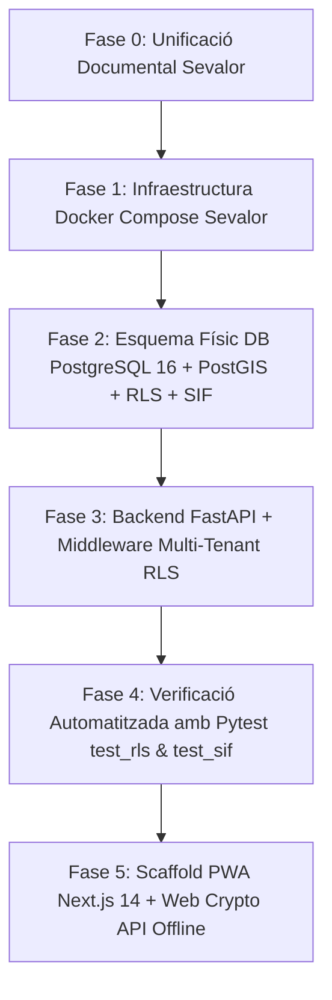

# Pla d'Implementació — SEVALOR Suite (Fundació i Nucli Multi-Tenant)

Aquest document estableix el pla tècnic d'implementació per al projecte **SEVALOR Suite**, aplicant de forma estricta la [Constitució](file:///media/akaun/Project_1/SEVALOR/sdd_sevalor/constitution.md), el manual [AGENTS.md](file:///media/akaun/Project_1/SEVALOR/sdd_sevalor/AGENTS.md), el [plan-v2.md](file:///media/akaun/Project_1/SEVALOR/sdd_sevalor/plan-v2.md) i el full de ruta de [tareas-implementacio-campopro.md](file:///media/akaun/Project_1/SEVALOR/sdd_sevalor/tareas-implementacio-campopro.md).

> [!IMPORTANT]
> **Canvi de denominació:** S'unifica el projecte sota la marca **SEVALOR**. Tots els mòduls, contenidors, esquemes, codis i documentació s'adapten de *CampoPro* a *SEVALOR* (excepte en els contextos multi-vertical on *CampoPro* fa referència a la vertical rústica/agrícola enfront d'*ElectricPro*, *HydroPro*, *BuildingPro*).
> **Mandat Zero Mock Data:** Cap component ni endpoint contindrà dades fictícies; es dissenyaran estats buits reals (*Empty States*).
> **Sobirania Hetzner / Cero AWS S3:** Emmagatzematge estricte en discs locals sota `/data/<empresa_id>/...` i `/docs/<empresa_id>/...`.

---

## Fases d'Execució Proposades



---

## 1. Fase 0: Unificació i Actualització Documental

- Actualitzar i renombrar les referències de la documentació a `sdd_sevalor` per reflectir **SEVALOR**:
  - `AGENTS.md`: Identitat Sevalor Suite, sentinella criptogràfic `SEVALOR_SENTINEL`.
  - `constitution.md`: Constitució de Sevalor Suite.
  - `plan-v2.md`: Pla de disseny mestre Sevalor.
  - Renombrar `tareas-implementacio-campopro.md` a `tareas-implementacio-sevalor.md` i mantenir la traçabilitat de tasques atòmiques.
  - `skills/campopro-guardian.md` -> `skills/sevalor-guardian.md`.

---

## 2. Fase 1: Infraestructura i Orquestració Docker (Tasca 1.1)

Configuració del fitxer [docker-compose.yml](file:///media/akaun/Project_1/SEVALOR/docker-compose.yml) a l'arrel de SEVALOR per a desenvolupament i producció Hetzner CPX21:
- `sevalor_db`: Imatge `postgis/postgis:16-3.4` amb volum local `pgdata`, port `127.0.0.1:5433:5432` (per evitar conflictes amb ports locals preexistents).
- `sevalor_redis`: Imatge `redis:7-alpine`, port `127.0.0.1:6380:6379`.
- `sevalor_postgrest`: Imatge `postgrest/postgrest:v12.0.2` amb `PGRST_DB_ANON_ROLE=anon`.
- `sevalor_whisper`: Imatge `fedirz/faster-whisper-server:latest-cpu` optimitzada per a CPU INT8 (Hetzner CPX21 sense GPU).
- `sevalor_backend`: Servei FastAPI asíncron.
- Fitxer `.env.example` i `.env` amb variables segures per defecte.

---

## 3. Fase 2: Esquema Físic de Base de Dades (Tasques 1.2 a 1.7)

Creació de les migracions SQL versionades a [db/migrations](file:///media/akaun/Project_1/SEVALOR/db/migrations):

### 1. `001_core_multitenant.sql` (Tasca 1.2)
- Taula `empreses`: UUID PK, raó social, NIF, subdomini, paleta HSL (primari, secundari), quotes de disc, pla SaaS.
- Taula `slots_jornada`: UUID PK, `empresa_id`, modalitat de jornada, hores teòriques, conveni.
- Taula `usuaris`: UUID PK, `empresa_id`, NIF, nom, cognoms, correu, telèfon, contrasenya hashed (bcrypt), rol (`BOSS`, `SECRETARIA`, `ENGINYER`, `COMPTABILITAT`, `CAP_DE_COLLA`, `OPERARI`), `secret_2fa`, `pin_hash`, `slot_jornada_id`. Restricció `UNIQUE (empresa_id, nif)`.

### 2. `002_rls_global.sql` (Tasca 1.3)
- Activació de `FORCE ROW LEVEL SECURITY` a totes les taules multi-tenant.
- Definició de polítiques estàndard per a cada taula que avaluïn:
  `empresa_id::text = current_setting('app.current_empresa_id', true)`
  (amb excepció controlada per a rols superadmin / bypass intern autoritzat).

### 3. `003_clients_finques.sql` (Tasca 1.4)
- Taula `clients`: Codi `CLI-XXXX`, raó social, NIF, telèfon, email, estat canal Telegram, IBAN xifrat AES-256.
- Taula `finques`: `coords_gps GEOMETRY(Point, 4326)`, codi de cadenat protegit, dades SIGPAC.

### 4. `004_magatzem.sql` (Tasca 1.5)
- Taula `articles`: Codi, nom, família, unitat de mesura, `parent_material_id` (autoreferencial per retalls de tubs/cables).
- Taules `magatzems` i `estocs_magatzem`: Estoc físic i virtual reservat.
- Taula `eines_custodia`: Número de sèrie, estat, custòdia per operari o vehicle.

### 5. `005_flota.sql` (Tasca 1.6)
- Taula `vehicles`: Matrícula, tipus, odòmetre i horòmetre acumulats, estat ITV en 4 veredictes.
- Taula `estancies_substitucio`: Gestió de vehicles de substitució.
- Taula `tiquets_carburant`: Litres, import, `tiquet_foto_path`, `odometre_foto_path` (doble evidència obligatòria).

### 6. `006_sif_inmutable.sql` (Tasca 1.7)
- Taula `registre_esdeveniments_sif`: Codi d'esdeveniment (EV-01 a EV-07), `hash_sello`, encadenament SHA-256.
- Trigger i funció PL/pgSQL que rebutja qualsevol `UPDATE` o `DELETE` llançant excepció i garantint inmutabilitat Veri*factu (RD 1007/2023).

---

## 4. Fase 3: Backend FastAPI i Middleware Multi-Tenant (Bloc 2 - Tasca 2.1)

Estructura modular a [backend/](file:///media/akaun/Project_1/SEVALOR/backend):
- `requirements.txt`: Llibreries segons [AGENTS.md](file:///media/akaun/Project_1/SEVALOR/sdd_sevalor/AGENTS.md) (FastAPI, uvicorn, asyncpg, SQLAlchemy 2, pydantic-settings, pytest, etc.).
- `app/core/config.py`: Configuració amb Pydantic Settings.
- `app/core/db.py`: Conexió asíncrona amb PostgreSQL (`asyncpg`), sessió asíncrona SQLAlchemy 2.0.
- `app/middleware/tenant.py`: Middleware que extreu el tenant (subdomini / header / token JWT) i executa `SET LOCAL app.current_empresa_id = :tenant_id` en la connexió asíncrona.
- `app/api/v1/health.py`: Endpoint d'estat del sistema i verificació de base de dades.
- `app/main.py`: Entrada de l'aplicació FastAPI amb CORS estricte i seguretat.

---

## 5. Fase 4: Suite de Proves Pytest Automatitzades (Tasca 2.2)

- [backend/tests/test_rls.py](file:///media/akaun/Project_1/SEVALOR/backend/tests/test_rls.py):
  - Crear dos inquilins diferents (`Tenant A` i `Tenant B`).
  - Executar consultes amb la sessió configurada a `Tenant A`.
  - Comprovar que el retorn per a registres de `Tenant B` és un conjunt buit `[]`, validant l'aïllament físic RLS.
- [backend/tests/test_sif.py](file:///media/akaun/Project_1/SEVALOR/backend/tests/test_sif.py):
  - Inserir un registre a `registre_esdeveniments_sif`.
  - Intentar fer un `UPDATE` o `DELETE` i certificar que la base de dades llança una excepció fatal.

---

## Pla de Verificació

### Proves Automatitzades
```bash
# 1. Aixecar contenidors Docker de Sevalor
cd /media/akaun/Project_1/SEVALOR
docker compose up -d db redis

# 2. Executar tests de backend (RLS, SIF, Healthcheck)
cd /media/akaun/Project_1/SEVALOR/backend
pytest -v tests/test_rls.py
pytest -v tests/test_sif.py

# 3. Validació de Linter i Tipat Estricte
ruff check .
mypy app/
```

### Verificació Manual
1. Inspeccionar contenidors actius amb `docker ps` i comprovar salut de `sevalor_db` i `sevalor_redis`.
2. Verificar taules i polítiques RLS a PostgreSQL directament mitjançant `psql`.
3. Comprovar que els triggers de seguretat bloquegen modificacions il·legítimes.
