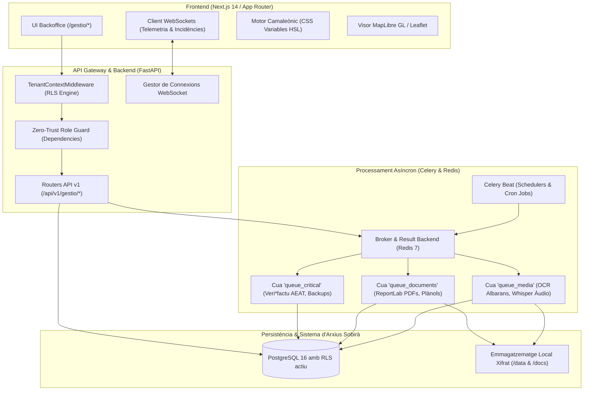

# Technical Plan: Backoffice Gestió (Arquitectura Tècnica, Esquema de Dades i Serveis)

**Feature Path**: `sevalor_AgentV2/specs/01-backoffice-gestio`  
**Status**: Consolidat (Migrat de les especificacions 001 a 011)  
**Stack Tècnic**: FastAPI (Python 3.12+), SQLAlchemy 2.0, PostgreSQL 16 amb Row Level Security (RLS), Redis 7, Celery 5, Next.js 14 (App Router), MapLibre GL / Leaflet, WebSockets.

---

## 1. Arquitectura del Sistema i Context Tècnic

El sistema de gestió s'estructura segons un patró híbrid orientat a serveis amb persistència multi-inquilí estricta a nivell de base de dades.



### Principis d'Aïllament i Sobirania de Dades
1. **Aïllament Multi-Inquilí (RLS)**: Totes les consultes i mutacions s'executen amb la sessió de PostgreSQL vinculada al paràmetre d'inquilí `SET LOCAL app.current_empresa_id = :empresa_id`. Això garanteix que cap operari o administrador pugui accedir a dades d'una altra companyia, fins i tot en cas d'errors a la capa d'aplicació.
2. **Sobirania de Dades Local**: Exclusió de proveïdors de núvol públics per a la custòdia d'arxius confidencials (LOPDGDD/RGPD). Els albarans, pòlisses, plànols i fotos pericials s'emmagatzemen a `/data/{empresa_id}/` i `/docs/{empresa_id}/` amb xifratge en repòs AES-256-GCM.
3. **Format de Comunicació en Temps Real**: Connexió persistent WebSocket a `/api/v1/gestio/ws` per a la transmissió de telemetria GPS de vehicles, canvis d'estat d'ordres de treball i obertura d'incidències al Drawer lateral.

---

## 2. Esquema de Base de Dades i Taules

Totes les entitats incorporen les columnes obligatòries d'auditoria `id` (UUIDv4), `empresa_id` (UUIDv4 amb política RLS), `creat_el` (TIMESTAMPTZ) i `actualitzat_el` (TIMESTAMPTZ).

```mermaid
erDiagram
    EMPRESES ||--o{ USUARIS : "te"
    EMPRESES ||--o{ CLIENTS : "gestiona"
    EMPRESES ||--o{ PROVEIDORS : "contracta"
    EMPRESES ||--o{ VEHICLES : "posseeix"
    EMPRESES ||--o{ ARTICLES : "emmagatzema"
    EMPRESES ||--o{ ORDRES_TREBALL : "executa"
    EMPRESES ||--o{ FACTURES_CAPCALERA : "emet"

    CLIENTS ||--o{ FINQUES : "te"
    CLIENTS ||--o{ ORDRES_TREBALL : "sol·licita"
    CLIENTS ||--o{ FACTURES_CAPCALERA : "rep"

    ORDRES_TREBALL ||--o{ INCIDENCIES : "genera"
    ORDRES_TREBALL ||--o{ FULLES_PICKING : "requereix"
    ORDRES_TREBALL ||--o{ PRESSUPOSTOS : "pressuposta"

    VEHICLES ||--o{ HISTORIAL_ASSIGNACIONS : "assignat_a"
    VEHICLES ||--o{ TIQUETS_COMBUSTIBLE : "consumeix"
    VEHICLES ||--o{ DOCUMENTS_FLOTA : "documenta"

    ARTICLES ||--o{ ESTOCS_MAGATZEM : "te_estoc"
    MAGATZEMS ||--o{ ESTOCS_MAGATZEM : "conte"
    ARTICLES ||--o{ MOVIMENTS_ESTOC : "registra"

    PROVEIDORS ||--o{ DOCUMENTS_CAE_RC : "acredita"
    PROVEIDORS ||--o{ ALBARANS_PROVEIDOR : "lliura"

    USUARIS ||--o{ REGISTRES_JORNADA : "fitxa"
    USUARIS ||--o{ EINES_CUSTODIA : "custodia"

    CARPETES_PLANOLS ||--o{ PLANOLS_BASE : "agrupa"
    PLANOLS_BASE ||--o{ CAPES_VECTORIALS : "conte"
    PLANOLS_BASE ||--o{ PINS_INCIDENCIA_PLANOL : "localitza"

    FACTURES_CAPCALERA ||--o{ FACTURES_LINIES : "desglossa"
    FACTURES_CAPCALERA ||--o{ OUTBOX_ENVIAMENTS_AEAT : "comunica"
```



### Taules Principals de l'Esquema:

1. **`empreses`**:
   - `id` (UUID, PK), `nom` (VARCHAR(150)), `cif` (VARCHAR(20), UNIQUE), `telefon` (VARCHAR(30)), `email` (VARCHAR(150)), `adreca` (TEXT).
   - `color_primari` (VARCHAR(10)), `color_secundari` (VARCHAR(10)), `logo_url` (VARCHAR(255)).
   - `jornada_estiu_activa` (BOOLEAN), `jornada_estiu_inici` (DATE), `jornada_estiu_fi` (DATE).
   - `telegram_bot_token` (VARCHAR(255)), `telegram_bot_username` (VARCHAR(100)).
   - `magatzem_families_default` (JSONB) — Llista de categories per vertical (Electricitat, Aigua, Clima).

2. **`usuaris`**:
   - `id` (UUID, PK), `empresa_id` (UUID, FK `empreses.id`), `nom` (VARCHAR(100)), `cognoms` (VARCHAR(150)), `email` (VARCHAR(150)), `telefon` (VARCHAR(30)).
   - `rol` (ENUM: `'BOSS'`, `'ENGINYER'`, `'SECRETARIA'`, `'CAPATAZ'`, `'OPERARI'`).
   - `password_hash` (VARCHAR(255)), `pin_pwa_hash` (VARCHAR(255)), `actiu` (BOOLEAN DEFAULT TRUE).
   - `totp_secret` (VARCHAR(64), nullable), `totp_habilitat` (BOOLEAN DEFAULT FALSE).
   - `carnet_conduir_valid` (BOOLEAN DEFAULT FALSE), `carnet_caducitat` (DATE, nullable).
   - `cost_hora_teoric` (NUMERIC(8,2), nullable — només visible per a Boss/Secretaria).

3. **`slots_jornada` & `registres_jornada_laboral` & `auditoria_registres_jornada`**:
   - `slots_jornada`: `usuari_id` (UUID, FK), `dia_setmana` (INT 1-7), `hora_inici` (TIME), `hora_fi` (TIME), `es_jornada_intensiva` (BOOLEAN).
   - `registres_jornada_laboral`: `id` (UUID, PK), `empresa_id` (UUID), `usuari_id` (UUID), `inici` (TIMESTAMPTZ), `fi` (TIMESTAMPTZ, nullable), `tancament_automatic` (BOOLEAN DEFAULT FALSE), `estat` (ENUM: `'OBERTA'`, `'TANCADA'`, `'ANOMALIA_REVISIO'`).
   - `auditoria_registres_jornada`: `registre_id` (UUID, FK), `modificat_per` (UUID, FK `usuaris.id`), `data_modificacio` (TIMESTAMPTZ), `motiu` (TEXT), `valor_anterior` (JSONB), `valor_nou` (JSONB).

4. **`clients` & `finques`**:
   - `clients`: `id` (UUID, PK), `empresa_id` (UUID), `rao_social` (VARCHAR(200)), `nif` (VARCHAR(20)), `telefon` (VARCHAR(30)), `email` (VARCHAR(150)), `iban` (VARCHAR(34)), `mandat_sepa_signat` (BOOLEAN), `mandat_sepa_data` (DATE).
   - `finques`: `id` (UUID, PK), `client_id` (UUID, FK `clients.id`), `nom` (VARCHAR(150)), `adreca` (TEXT), `latitud` (NUMERIC(10,7)), `longitud` (NUMERIC(10,7)), `ref_cadastral` (VARCHAR(50)), `sigpac_poligon` (INT), `sigpac_parcela` (INT), `codi_acces_candat` (VARCHAR(50)).

5. **`proveidors` & `documents_cae_rc`**:
   - `proveidors`: `id` (UUID, PK), `empresa_id` (UUID), `rao_social` (VARCHAR(200)), `cif` (VARCHAR(20)), `categoria` (VARCHAR(100)), `telefon` (VARCHAR(30)), `email` (VARCHAR(150)), `iban` (VARCHAR(34)), `percentatge_retencio_garantia` (NUMERIC(5,2) DEFAULT 0.00).
   - `documents_cae_rc`: `id` (UUID, PK), `proveidor_id` (UUID, FK `proveidors.id`), `tipus` (ENUM: `'POLISSA_RC'`, `'CERTIFICAT_AEAT'`, `'CERTIFICAT_TGSS'`), `fitxer_path` (VARCHAR(255)), `data_caducitat` (DATE), `estat_validacio` (ENUM: `'VALID'`, `'CADUCAT'`, `'PENDENT_REVISIO'`).

6. **`articles`, `magatzems`, `estocs_magatzem`, `moviments_estoc`**:
   - `articles`: `id` (UUID, PK), `empresa_id` (UUID), `referencia` (VARCHAR(50)), `nom` (VARCHAR(150)), `familia` (VARCHAR(50)), `unitat_mesura` (VARCHAR(20)), `es_format_continu` (BOOLEAN DEFAULT FALSE), `longitud_bobina_estandard` (NUMERIC(8,2)), `preu_cost_pmp` (NUMERIC(10,4)), `preu_venda` (NUMERIC(10,4)), `estoc_minim` (NUMERIC(10,2)).
   - `magatzems`: `id` (UUID, PK), `nom` (VARCHAR(100)), `tipus` (ENUM: `'CENTRAL'`, `'FURGONETA'`), `vehicle_id` (UUID, FK `vehicles.id`, nullable).
   - `estocs_magatzem`: `article_id` (UUID, FK `articles.id`), `magatzem_id` (UUID, FK `magatzems.id`), `quantitat_disponible` (NUMERIC(10,2)), `quantitat_reservada` (NUMERIC(10,2)), `retalls_disponibles` (JSONB) — llista de fragments continus [m].
   - `eines_custodia`: `id` (UUID, PK), `article_id` (UUID, FK), `numero_serie` (VARCHAR(100)), `codi_barres` (VARCHAR(50)), `operari_custodia_id` (UUID, FK `usuaris.id`, nullable), `vehicle_id` (UUID, FK, nullable), `estat` (ENUM: `'OPERATIVA'`, `'EN_REPARACIO'`, `'BAIXA_DEFINITIVA'`, `'PERDUDA'`).

7. **`vehicles`, `historial_assignacions_vehicles`, `tiquets_combustible`, `documents_flota`**:
   - `vehicles`: `id` (UUID, PK), `empresa_id` (UUID), `matricula` (VARCHAR(20)), `marca_model` (VARCHAR(100)), `tipus_actiu` (ENUM: `'FURGONETA'`, `'TURISME'`, `'CAMIO'`, `'MAQUINARIA_PESANT'`, `'REMOLC'`), `propulsio` (ENUM: `'DIESEL'`, `'GASOLINA'`, `'ELECTRIC_100'`, `'HIBRID_PHEV'`), `mma_kg` (NUMERIC(8,2)), `requereix_tacograf` (BOOLEAN DEFAULT FALSE), `distintiu_ambiental` (VARCHAR(10)), `odometre_km` (NUMERIC(10,1)), `horometre_h` (NUMERIC(10,1)), `estat_operatiu` (ENUM: `'OPERATIU'`, `'OPERATIU_DEFECTES_LLEUS'`, `'IMMOBILITZAT_TALLER'`, `'BAIXA'`).
   - `documents_flota`: `vehicle_id` (UUID, FK), `tipus` (ENUM: `'ITV'`, `'ASSEGURANCA'`, `'TACÒGRAF'`, `'SANCIO_RGPD'`), `data_venciment` (DATE), `fitxer_path` (VARCHAR(255)), `conductor_id` (UUID, FK, nullable — per a sancions de trànsit sota RGPD).

8. **`ordres_treball`, `fulles_picking`, `incidencies`, `pressupostos`**:
   - `ordres_treball`: `id` (UUID, PK), `empresa_id` (UUID), `client_id` (UUID, FK), `finca_id` (UUID, FK), `supervisor_id` (UUID, FK), `capataz_id` (UUID, FK), `vehicle_id` (UUID, FK), `titol` (VARCHAR(200)), `descripcio` (TEXT), `estat` (ENUM: `'PENDENT'`, `'PROGRAMADA'`, `'EN_CURS'`, `'BLOQUEJADA_ACCES'`, `'FINALITZADA'`, `'CANCEL_LADA'`), `data_programada` (DATE), `hora_inici_real` (TIMESTAMPTZ), `hora_fi_real` (TIMESTAMPTZ), `latitud` (NUMERIC(10,7)), `longitud` (NUMERIC(10,7)).
   - `incidencies`: `id` (UUID, PK), `ordre_treball_id` (UUID, FK), `grau` (ENUM: `'LLEU'`, `'MODERADA'`, `'URGENT_BLOQUEJANT'`), `tipus` (ENUM: `'ACCES_TANCAT'`, `'MATERIAL_EXTRA'`, `'AVARIA_MECANICA'`, `'IMPREVIST_OBRA'`), `audio_path` (VARCHAR(255)), `transcripcio_audio` (TEXT), `fotos_paths` (JSONB), `pressupost_suggerit_ia` (JSONB), `aprovacio_hitl_supervisor` (BOOLEAN DEFAULT FALSE), `aprovacio_client` (BOOLEAN, nullable), `resolta` (BOOLEAN DEFAULT FALSE).

9. **`factures_capcalera`, `factures_linies`, `outbox_enviaments_aeat`, `registre_esdeveniments_sif`**:
   - `factures_capcalera`: `id` (UUID, PK), `empresa_id` (UUID), `client_id` (UUID, FK), `serie` (VARCHAR(10)), `numero` (INT), `data_emissio` (DATE), `base_imposable` (NUMERIC(12,2)), `quota_iva` (NUMERIC(12,2)), `total_factura` (NUMERIC(12,2)), `es_inversio_subjecte_passiu` (BOOLEAN DEFAULT FALSE), `hash_cadena_sha256` (VARCHAR(64)), `hash_anterior_sha256` (VARCHAR(64)), `qr_code_data` (TEXT), `estat` (ENUM: `'PROFORMA'`, `'EMESA'`, `'RECTIFICADA'`).
   - `factures_linies`: `id` (UUID, PK), `factura_id` (UUID, FK), `ordre_treball_id` (UUID, FK, nullable), `concepte` (VARCHAR(255)), `quantitat` (NUMERIC(10,2)), `preu_unitari` (NUMERIC(10,4)), `percentatge_iva` (NUMERIC(5,2)), `subtotal` (NUMERIC(12,2)).
   - `outbox_enviaments_aeat`: `id` (UUID, PK), `factura_id` (UUID, FK), `xml_payload` (TEXT), `intents` (INT DEFAULT 0), `estat` (ENUM: `'PENDENT'`, `'ENVIAT'`, `'ERROR_REINTENTABLE'`, `'REBUTJAT'`), `resposta_aeat` (TEXT).

10. **`carpetes_planols`, `planols_base`, `capes_vectorials`, `pins_incidencia_planol`**:
    - `carpetes_planols`: `id` (UUID, PK), `empresa_id` (UUID), `client_id` (UUID, FK, nullable), `nom` (VARCHAR(100)), `carpeta_pare_id` (UUID, FK `carpetes_planols.id`, nullable).
    - `planols_base`: `id` (UUID, PK), `carpeta_id` (UUID, FK), `nom` (VARCHAR(150)), `fitxer_path` (VARCHAR(255)), `format` (ENUM: `'GEOJSON'`, `'KML'`, `'PDF'`, `'TIFF'`, `'PNG'`), `calibratge_gis` (JSONB) — coordenades de referència i rotació.
    - `capes_vectorials`: `id` (UUID, PK), `planol_base_id` (UUID, FK), `nom` (VARCHAR(100)), `tipus_xarxa` (ENUM: `'AIGUA_PRESSIO'`, `'CANAL_REG'`, `'BAIXA_TENSIO'`, `'FIBRA_TELECOM'`), `geojson_features` (JSONB), `color_hex` (VARCHAR(10)).

---

## 3. Catàleg d'Endpoints de l'API REST (`/api/v1/gestio/*`)

| Mètode | Ruta Endpoint | Rols Autoritzats | Descripció de l'Operació |
| :--- | :--- | :--- | :--- |
| **GET** | `/api/v1/gestio/dashboard/hud` | BOSS, ENGINYER, SECRETARIA | Retorna el pols operatiu en viu (ordres actives, colles en camp, incidències pendents). Sense dades econòmiques. |
| **GET** | `/api/v1/gestio/dashboard/incidencies-drawer` | BOSS, ENGINYER | Llistat reactiu d'incidències de camp obertes per al calaix lateral, amb àudios i fotos. |
| **PATCH** | `/api/v1/gestio/dashboard/incidencies/{id}/aprova-hitl` | BOSS, ENGINYER | Validació humana (HITL) del pressupost d'imprevistos generat per Copilot per al seu enviament al client. |
| **GET** | `/api/v1/gestio/clients` | BOSS, SECRETARIA, ENGINYER | Llistat paginat de clients del tenant amb filtres reactius. |
| **POST** | `/api/v1/gestio/clients` | BOSS, SECRETARIA | Alta de nou client amb validació algorítmica de NIF/CIF. |
| **GET** | `/api/v1/gestio/clients/{id}/finques` | BOSS, SECRETARIA, ENGINYER | Consulta de finques i escomeses georeferenciades del client. |
| **POST** | `/api/v1/gestio/clients/{id}/finques` | BOSS, ENGINYER | Creació de nova finca amb coordenades GPS i dades SIGPAC. |
| **GET** | `/api/v1/gestio/proveidors` | BOSS, SECRETARIA, ENGINYER | Llistat de distribuïdors i subcontractes amb estat de pòlisses RC. |
| **POST** | `/api/v1/gestio/proveidors/ocr-albara` | BOSS, SECRETARIA | Ingesta de fitxer (multipart/form-data) d'albarà per a extracció OCR assistida. |
| **GET** | `/api/v1/gestio/magatzem/articles` | BOSS, SECRETARIA, ENGINYER | Catàleg d'articles amb estocs. Els preus de cost s'ometen automàticament per al rol ENGINYER. |
| **POST** | `/api/v1/gestio/magatzem/articles` | BOSS, SECRETARIA | Alta d'article amb categorització segons la vertical de l'empresa. |
| **POST** | `/api/v1/gestio/magatzem/traspas-furgoneta` | BOSS, SECRETARIA, ENGINYER | Transferència d'estoc entre la nau central i el magatzem d'una furgoneta. |
| **GET** | `/api/v1/gestio/feines/mapa` | BOSS, ENGINYER | Capes cartogràfiques completes: obres georeferenciades, colles actives i xarxes pròpies. |
| **PATCH** | `/api/v1/gestio/feines/{id}/drop-and-go` | BOSS, ENGINYER | Reassignació d'ordre arrossegada sobre el mapa cap a una altra colla o franja horària. |
| **GET** | `/api/v1/gestio/flota` | BOSS, SECRETARIA, ENGINYER | Llistat de vehicles, maquinària i remolcs amb semàfor d'estat d'ITV i assegurança. |
| **POST** | `/api/v1/gestio/flota/ocr-odometre` | BOSS, ENGINYER, CAPATAZ | Processament de foto del quadre de comandament per a extracció de quilòmetres. |
| **GET** | `/api/v1/gestio/comptabilitat/factures` | **BOSS, SECRETARIA** *(Veto Enginyer)* | Llibre de facturació emesa amb cadenes de seguretat Veri*factu. |
| **POST** | `/api/v1/gestio/comptabilitat/factures` | BOSS, SECRETARIA | Emissió de nova factura oficial amb bloqueig `SELECT FOR UPDATE` per a l'encadenament SHA-256. |
| **GET** | `/api/v1/gestio/comptabilitat/factures/{id}/xml` | BOSS, SECRETARIA | Generació del document XML reglamentari AEAT Veri*factu. |
| **GET** | `/api/v1/gestio/comptabilitat/tresoreria` | **BOSS ÚNICAMENT** | Panell de flux de caixa, conciliació bancària Norma 43 i remeses SEPA. |
| **GET** | `/api/v1/gestio/operaris` | BOSS, SECRETARIA, ENGINYER | Directori d'operaris i estat de disponibilitat de camp. |
| **POST** | `/api/v1/gestio/operaris/{id}/reset-pin-sms` | BOSS, SECRETARIA | Generació de nou PIN PWA i enviament segur via SMS al mòbil de l'empleat. |
| **GET** | `/api/v1/gestio/operaris/{id}/control-horari` | **BOSS, SECRETARIA** *(Veto Enginyer)* | Registre de fitxatges de jornada i detecció d'anomalies de més de 8 hores obertes. |
| **GET** | `/api/v1/gestio/notificacions/converses` | BOSS, SECRETARIA, ENGINYER | Safata multicanal de comunicacions amb clients (Email i Telegram). |
| **POST** | `/api/v1/gestio/notificacions/converses/{id}/missatge` | BOSS, SECRETARIA, ENGINYER | Enviament de resposta oficial al client pel seu canal actiu. |
| **GET** | `/api/v1/gestio/planols/carpetes` | BOSS, ENGINYER | Arbre documental de plànols ordenat per clients i projectes. |
| **POST** | `/api/v1/gestio/planols/pujar` | BOSS, ENGINYER | Càrrega de fitxers de xarxa o plànols (GeoJSON, KML, DXF, PDF). |
| **GET** | `/api/v1/gestio/configuracio/empresa` | BOSS, SECRETARIA | Lectura de configuració del tenant, slots d'horaris i marca camaleònica. |
| **PUT** | `/api/v1/gestio/configuracio/marca` | BOSS ÚNICAMENT | Actualització de colors corporatius HSL i logotip oficial de l'empresa. |

---

## 4. Middlewares, Seguretat i Gestió de Context

### 1. Tenant Context & RLS Enforcement
El middleware principal extreu el reclam `empresa_id` del token JWT validat i l'injecta a la sessió de PostgreSQL:
```python
# Patró d'injecció de context de base de dades
async def get_db_with_tenant_context(
    request: Request,
    token_data: TokenPayload = Depends(auth_service.verify_jwt_token)
):
    async with async_session_factory() as session:
        # Injecció estricta del paràmetre de sessió per a polítiques RLS
        await session.execute(
            text("SET LOCAL app.current_empresa_id = :empresa_id"),
            {"empresa_id": str(token_data.empresa_id)}
        )
        yield session
```

### 2. Zero-Trust Role-Based Access Control (RBAC)
Els endpoints utilitzen dependències de comprovació que llancen immediatament `HTTP 403 Forbidden` si el rol no està expressament autoritzat:
- El rol `ENGINYER` té vetat qualsevol accés a `/api/v1/gestio/comptabilitat/*` i a les rutes de nòmines i salaris de `/api/v1/gestio/operaris/*/control-horari`.
- El rol `SUPERADMIN` (gestor d'infraestructura) té denegat l'accés a dades corporatives de gestió del tenant per evitar contaminació creuada.

### 3. Configuració Dinàmica de CORS
El middleware de CORS resol dinàmicament els orígens permesos basant-se en els subdominis dels tenants actius, garantint que qualsevol excepció (com ara `HTTPException 400` en validació d'UUIDs) preservi les capçaleres `Access-Control-Allow-Origin` per evitar errors de preflight del navegador.

---

## 5. Treballadors Asíncrons i Tasques Celery

El clúster de Celery s'organitza en tres cues dedicades per garantir que tasques pesants d'imatge o àudio no bloquegin enviaments legals crítics:

### Cues de Treball:
1. **`queue_critical`**:
   - `processar_outbox_aeat`: Despatxa de forma periòdica les factures en cua cap al servei SOAP de l'AEAT per al compliment Veri*factu, amb gestió de reintents exponencials.
   - `generar_backup_pgdump`: Execució programada de còpies de seguretat de la base de dades per empresa amb compressió gzip a `/tmp/data/{empresa_id}/backups/`.
2. **`queue_documents`**:
   - `generar_informe_post_obra`: Generació del PDF oficial de liquidació d'obra amb ReportLab, integrant signatures, resum de materials, hores d'operaris i el protocol de les 3 fotos pericials.
   - `generar_informe_planol_pdf`: Renderització del dossier tècnic de plànol amb el caixetí oficial i la llegenda de xarxes.
3. **`queue_media`**:
   - `processar_ocr_document_task`: Anàlisi de fotografies i PDFs d'albarans de proveïdors i tiquets de despeses per extreure números de document, NIFs, referències d'articles i totals.
   - `transcriure_audio_task`: Transcripció de notes de veu de camp (30s màxim) capturades per la PWA utilitzant un node local de Whisper (model quantitzat INT8).

### Programació de Tasques Periòdiques (Celery Beat):
- **Tancament Cautelar de Jornades**: Cada 15 minuts, revisió de registres de control horari oberts fa més de 8 hores per procedir al seu tancament automàtic i marcatge d'anomalia.
- **Alertes Preventives de Flota**: Cada matí a les 06:00, revisió de caducitats d'ITV i assegurances a 30, 15, 5 i 1 dia, així com l'avís de descàrrega de targeta de tacògraf cada 28 dies.
- **Rollback de Demores d'Obra Inconclusa**: Cada dia a les 18:00, regularització de comptadors de temps per a obres marcades en estat "Accés Bloquejat" que no s'hagin pogut reprendre.

---

## 6. Arquitectura Frontend i Gestió d'Estat

### Estructura de Rutes Next.js 14 (App Router)
```text
app/
└── gestio/
    ├── layout.tsx              # Shell corporatiu, capçalera universal HUD i motor camaleònic
    ├── page.tsx                # Torre de control principal: mapa interactiu i drawer d'incidències
    ├── clients/
    │   ├── page.tsx            # Directori tabular paginat de clients
    │   └── [id]/page.tsx       # Fitxa detallada del client, finques i historial
    ├── proveidors/
    │   └── page.tsx            # Llistat de proveïdors, estat de pòlisses RC i OCR d'albarans
    ├── magatzem/
    │   └── page.tsx            # Inventari multilocació, materials continus i eines sense QR
    ├── feines/
    │   └── mapa/page.tsx       # Vista alternativa de seguiment de feines i rutes
    ├── flota/
    │   └── page.tsx            # Parc mòbil, odòmetres, revisions i tacògraf
    ├── comptabilitat/
    │   └── page.tsx            # Facturació Veri*factu, tresoreria i balanços (Restringit)
    ├── operaris/
    │   └── page.tsx            # Plantilla, fitxa 360°, control horari i galeria de 3 fotos
    ├── notificacions/
    │   └── page.tsx            # Hub multicanal de missatges i bot Telegram de clients
    ├── planols/
    │   └── page.tsx            # Visor GIS per capes i biblioteca de projectes
    └── configuracio/
        └── page.tsx            # Identitat de marca, slots de jornada laboral i usuaris
```

### Motor Camaleònic Dinàmic
La interfície injecta les variables d'estil en temps d'execució al tag `:root` a partir de les dades del tenant:
```css
:root {
  --primary: hsl(var(--tenant-primary-h) var(--tenant-primary-s) var(--tenant-primary-l));
  --secondary: hsl(var(--tenant-secondary-h) var(--tenant-secondary-s) var(--tenant-secondary-l));
}
```
Això assegura que l'experiència visual s'adapti de forma automàtica als colors de cada empresa client sense necessitat de recompilar l'aplicació.
