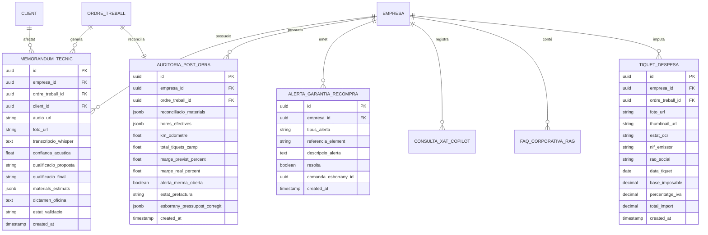
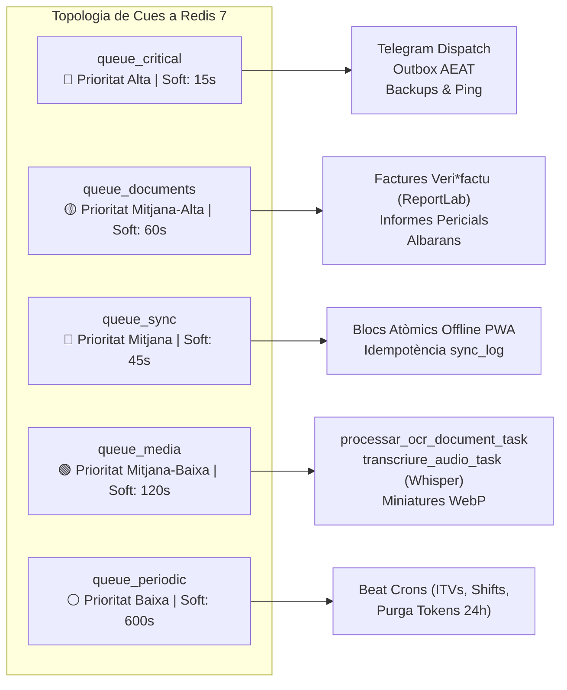

# Implementation Plan: Core IA, OCR, Bot de Telegram & Processament Asíncron

**Branch**: `03-core-ia-ocr-bot` | **Date**: 2026-09-29 | **Spec**: [spec.md](file:///media/akaun/Project_1/SEVALOR/sevalor_AgentV2/specs/03-core-ia-ocr-bot/spec.md)  
**Input**: Macro-Feature que unifica el Copilot IA de Camp i Gestió (Spec 012, specc_copilot), el Microservei de Bot de Telegram per a Clients Finals (Spec 023) i els Workers de Fons, Facturació Veri*factu i Processament Asíncron (Spec 024).

---

## 1. Summary & Architecture Overview

Aquest pla tècnic descriu la implementació del subsistema intel·ligent, computacional i asíncron de CampoPro Suite. Està dissenyat per garantir un rendiment d'alta concurrència (Zero-Blocking), total sobirania de dades i aïllament multi-tenant rígid sobre infraestructura Hetzner a Alemanya.

L'arquitectura es compon de cinc peces principals desacoblades:
1. **API Backend Asíncrona (FastAPI / Python 3.12)**: Exposa els endpoints de gestió del Copilot (`/api/v1/gestio/copilot`), el registre d'alta ràpida OCR per a totes les entitats, i les rutes d'estat de workers.
2. **Workers de Fons i Planificador (Celery 5.3+ & Celery Beat)**: Processos concurrents d'alta capacitat connectats a un broker **Redis 7** organitzat en cinc cues prioritzades (`queue_critical`, `queue_documents`, `queue_sync`, `queue_media`, `queue_periodic`).
3. **Node Local Sobirà d'Intel·ligència Artificial (Whisper v3 + LM Studio / Ollama REST API)**: Processament 100% local d'inferència de llenguatge (RAG sectorial per vertical i Tool Calling), transcripció d'àudio i visió pericial sobre models locals.
4. **Microservei del Bot de Telegram (aiogram 3.x en contenidor dedicat)**: Interacció asíncrona bidireccional amb els clients finals via Webhooks HTTPS securitzats, FSM sobre Redis i enllaços temporals de 24 hores.
5. **Motor de Facturació i Traçabilitat Legal (ReportLab + Outbox Pattern)**: Generació asíncrona de documents PDF Veri*factu (RD 1007/2023) amb bloqueig pessimista (`SELECT FOR UPDATE`), encadenament de Hash SHA-256 i codis QR estructurats de la AEAT.

```mermaid
flowchart TD
    subgraph ClientLayer["Clients & Frontends"]
        PWA["PWA Operari (/operari)"]
        WEB["Next.js Gestió (/gestio)"]
        TG["Client Final (Telegram)"]
    end

    subgraph APILayer["FastAPI Gateway"]
        API["FastAPI App (Python 3.12)"]
        TGM["Telegram Webhook Route"]
        OCR_EP["OCR Endpoints (Drafts)"]
    end

    subgraph AsyncBroker["Broker & Estat"]
        REDIS[("Redis 7 (Broker & FSM)")]
    end

    subgraph WorkersLayer["Processament Asíncron"]
        CW["celery_worker (Multi-concurrència)"]
        CB["celery_beat (Tasques Periòdiques)"]
    end

    subgraph AINode["Node Local Sobirà Hetzner"]
        LM["LM Studio / Ollama (LLM Local)"]
        WHISPER["Whisper v3 (Àudio)"]
        VISION["Llama-Vision / OCR Local"]
    end

    subgraph DataStorage["Emmagatzematge Sobirà"]
        PG[("PostgreSQL 16 (RLS Actiu)")]
        FS["Disc Local (/data/<tenant>/ & /docs/<tenant>/)"]
    end

    PWA -->|Foto/Voz Incidència / Tiquets| API
    WEB -->|Xat Copilot / Reconciliació / Alta OCR| API
    TG -->|Callback / Fotos / Aprovació| TGM
    TGM --> API
    API -->|task.delay() / apply_async()| REDIS
    REDIS --> CW
    CB -->|Cron Events| REDIS
    CW -->|Inferència / RAG| LM
    CW -->|Transcripció| WHISPER
    CW -->|OCR & Miniatures| VISION
    CW -->|SET LOCAL app.current_empresa_id| PG
    CW -->|PDFs / XML Outbox / Fotos| FS
```

---

## 2. Technical Context

- **Llenguatge i Entorn**: Python 3.12 (typing complet, suport asíncron natiu).
- **Framework Web**: FastAPI 0.110+ (Uvicorn / Gunicorn).
- **Framework de Bot**: aiogram 3.x (asíncron, suport de FSM i Inline Keyboards).
- **Broker de Missatgeria & Cache**: Redis 7.2 (amb persistència AOF i xifrat per contrasenya).
- **Motor de Cues**: Celery 5.3+ (amb `acks_late=True`, `reject_on_worker_lost=True`).
- **Base de Dades**: PostgreSQL 16 amb Row Level Security (RLS) mandatori.
- **ORM**: SQLAlchemy 2.0 (motor `asyncpg` per al backend, sessions aïllades per worker).
- **Motor de Documents PDF**: ReportLab 4.1+ (amb suport per a caixetins vectorials, tipografies locals i codis QR).
- **Node d'IA Local**:
  - LLM: LM Studio / Ollama accessible via HTTP local (`http://127.0.0.1:1234/v1` o intern Docker `http://host.docker.internal:11434`).
  - Àudio: Whisper v3 local (`whisper-medium` o `whisper-large-v3`).
  - Visió & OCR: Model local multimodal o Tesseract / LLaVA-Vision local.
- **Emmagatzematge de Fitxers**: Sistema d'arxius local Hetzner (`/data/<empresa_id>/...` i `/docs/<empresa_id>/...`), xifrat en repòs AES-256-GCM. Prohibit AWS S3 o núvols públics.

---

## 3. Database Schema & Models

Totes les taules s'aïllen obligatòriament mitjançant PostgreSQL Row Level Security (RLS) injectant `app.current_empresa_id`.



### Principals Models SQLAlchemy (`app/models/models.py`)

1. **`MemorandumTecnicCopilot`**:
   - `id`: UUID (Primary Key)
   - `empresa_id`: UUID (FK Empresa, Indexat, RLS Filter)
   - `ordre_treball_id`: UUID (FK OrdreTreball)
   - `client_id`: UUID (FK Client)
   - `audio_path`: String (Ruta local sobirana al fitxer `.webm`/`.ogg`)
   - `foto_path`: String (Ruta local a la imatge geolocalitzada)
   - `transcripcio_audio`: Text (Resultat fonètic de Whisper v3)
   - `confianca_acustica`: Float (Detecta si < 0.40 per soroll de tractors/vent)
   - `qualificacio_proposta`: Enum (`EXTRA_FACTURABLE`, `COST_INTERN`, `GARANTIA`)
   - `qualificacio_final`: Enum (`EXTRA_FACTURABLE`, `COST_INTERN`, `GARANTIA`)
   - `dictamen_tecnic`: Text (Redacció executiva del memoràndum)
   - `materials_proposats`: JSONB (Desglose de peces necessàries)
   - `estat`: Enum (`PENDENT_REVISIO`, `APROVAT_ENGINYER`, `REBUTJAT`)
   - `creat_el`: DateTime (amb timezone UTC)

2. **`AuditoriaPostObra`**:
   - `id`: UUID (Primary Key)
   - `empresa_id`: UUID (FK Empresa, RLS Filter)
   - `ordre_treball_id`: UUID (FK OrdreTreball, Unique)
   - `desviacio_materials`: JSONB (Línies de picking vs. retornades vs. previstes)
   - `desviacio_hores`: JSONB (Minuts previstos vs. fitxatges efectius GPS)
   - `km_recorreguts`: Float (Lectura d'odòmetre per fotografia validada)
   - `total_despeses_camp`: Decimal(10, 2) (Suma de tiquets aprovats)
   - `marge_previst`: Float
   - `marge_real`: Float
   - `alerta_merma`: Boolean (True si caiguda > 5% o material continu > 250%)
   - `pressupost_corregit_json`: JSONB (Línies de pre-factura)
   - `estat`: Enum (`PENDENT_REVISIO`, `CONFIRMAT_PER_FACTURAR`)

3. **`AlertaGarantiaRecompra`**:
   - `id`: UUID (Primary Key)
   - `empresa_id`: UUID (FK Empresa, RLS Filter)
   - `tipus`: Enum (`GARANTIA_FABRICANT`, `GARANTIA_SERVEI`, `STOCK_SOTA_MINIM`)
   - `element_afectat`: String (Model, Número de Sèrie o Ref. Article)
   - `detall`: Text
   - `data_expiracio_garantia`: Date (nullable)
   - `comanda_esborrany_generada`: Boolean (per a compres preventives)
   - `resolta`: Boolean (default False)

4. **`Client` (Extensions Telegram)**:
   - `telegram_chat_id`: BigInteger (Nullable, Unique per empresa)
   - `telegram_onboarding_token`: String (Hash unívoc temporal de 48h)
   - `telegram_linked_at`: DateTime (Nullable)

5. **`TiquetDespesa` (Extensions OCR)**:
   - `foto_tiquet`: String
   - `thumbnail_webp`: String
   - `estat_ocr`: Enum (`PENDENT_PROCESSAMENT`, `EXTRET_AUTOMATIC`, `REVISIO_MANUAL`, `CONFIRMAT`)
   - `nif_proveidor`: String
   - `total_tiquet`: Decimal(10, 2)
   - `iva_percent`: Decimal(5, 2)

---

## 4. API Routes Specifications

### 4.1 Mòdul Copilot d'IA (`/api/v1/gestio/copilot`)

| Mètode | Ruta | Permisos (Rols) | Descripció |
| :--- | :--- | :--- | :--- |
| `GET` | `/estat-node` | `BOSS`, `SECRETARIA`, `ENGINYER` | Comprova la salut i disponibilitat del node d'IA local (LM Studio / Whisper). |
| `GET` | `/garanties/auditoria` | `ENGINYER`, `BOSS` | Audita l'històric 360° de la finca (últims 365 dies) i garanties actives per número de sèrie. |
| `POST` | `/incidencies/peritatge` | `ENGINYER`, `BOSS` | Rep àudio + foto de camp, transcriu via Whisper, analitza visió i redacta Memoràndum Tècnic. |
| `PUT` | `/memorandums/{memo_id}/validacio` | `ENGINYER`, `BOSS` | Validació humana (HITL): aprova o rectifica qualificació d'Extra vs. Cost Intern. |
| `GET` | `/memorandums` | `ENGINYER`, `SECRETARIA`, `BOSS` | Llistat filtrat de memoràndums pendents i històrics del tenant. |
| `POST` | `/reconciliacio/post-obra` | `ENGINYER`, `BOSS` | Executa la reconciliació dels 4 pilars (materials, hores, km, tiquets) i calcula desviacions. |
| `PUT` | `/reconciliacio/{auditoria_id}/aprovar-pressupost` | `ENGINYER`, `BOSS` | Valida el pressupost corregit i el transfereix a safata de facturació. |
| `POST` | `/stock/verificacio-assignacio` | `ENGINYER`, `BOSS` | Verifica caiguda d'estoc sota mínims en assignar feina i crea esborrany de recompra. |
| `POST` | `/xat` | `BOSS`, `SECRETARIA`, `ENGINYER` | Xat tècnic amb RAG sectorial per vertical i filtre de veto financer per rol. |
| `GET` | `/alertes` | `BOSS`, `SECRETARIA`, `ENGINYER` | Safata d'alertes preventives actives de garantia i recompra de stock. |
| `POST` | `/rag` | `BOSS`, `ENGINYER` | Afegeix documentació corporativa privada al RAG de l'empresa. |
| `GET` | `/rag` | `BOSS`, `ENGINYER` | Llista de documents i protocols indexats a la base de coneixement. |
| `POST` | `/action/confirm` | `BOSS`, `ENGINYER` | Execució confirmada d'una acció proposada mitjançant Tool Calling de la IA. |

### 4.2 Endpoints d'Alta Màgica OCR ("Zero Data Entry")

| Mètode | Ruta | Format Càrrega | Descripció |
| :--- | :--- | :--- | :--- |
| `POST` | `/api/v1/gestio/flota/ocr-draft` | `multipart/form-data` (`file`) | Processa Fitxa Tècnica / Permís de Circulació i retorna esborrany JSON de Vehicle (Zero Data Entry). |
| `POST` | `/api/v1/gestio/magatzem/albara/ocr` | `multipart/form-data` (`file`) | Encua a Celery el reconeixement d'albarà/factura de compra i extreu articles i eines per a l'estoc. |
| `POST` | `/api/v1/gestio/proveidors/ocr-draft` | `multipart/form-data` (`file`) | Extreu dades fiscals (CIF, raó social, domicili) per a l'alta ràpida de proveïdors a 1 clic. |
| `POST` | `/api/v1/operari_pwa/tiquets/ocr` | `multipart/form-data` (`file`) | Analitza tiquet de despesa pujat per operari, extreu total/NIF/data i genera miniatura WebP. |

### 4.3 Endpoints de Webhook Telegram & Microservei

| Mètode | Ruta | Protecció | Descripció |
| :--- | :--- | :--- | :--- |
| `POST` | `/api/v1/webhooks/telegram` | `X-Telegram-Bot-Api-Secret-Token` | Recepció d'updates de Telegram despatxats per Nginx (missatges, comandes `/start`, callbacks). |
| `POST` | `/api/v1/telegram/webhook/{empresa_id}` | `X-Telegram-Bot-Api-Secret-Token` | Ruta dinàmica multi-bot per a tenants amb bot privat dedicat. |

### 4.4 Endpoints de Gestió de Workers

| Mètode | Ruta | Resposta | Descripció |
| :--- | :--- | :--- | :--- |
| `GET` | `/api/v1/workers/status/{task_id}` | `{"task_id", "estat", "resultat"}` | Permet el sondeig reactiu (polling) de l'estat d'una tasca encolada a Celery/Redis. |

---

## 5. Celery Topology & Task Definitions

Per garantir que les operacions lentes mai degradin la missatgeria urgent, es defineix una topologia de cinc cues especialitzades a Redis 7:



### Especificació de Cues i Tasques

1. **`queue_critical`** (Prioritat Alta, Soft Timeout: 15s):
   - `app.workers.tasks.ping`: Prova de connectivitat i Health Check dels workers.
   - `app.workers.tasks.despatxar_missatge_telegram`: Enviament de notificacions amb token bucket rate limiter.
   - `app.workers.tasks.processar_outbox_aeat`: Transmissió desacoblada de registres de facturació cap a la seu telemàtica tributària.
   - `app.workers.tasks.generar_backup_pgdump`: Bolcat PostgreSQL xifrat.

2. **`queue_documents`** (Prioritat Mitjana-Alta, Soft Timeout: 60s):
   - `generar_factura_verifactu_pdf`: Compilació ReportLab amb Hash Chaining SHA-256 (`SELECT FOR UPDATE`), generació de codi QR fiscal i gravació a `/docs/<empresa_id>/factures/`.
   - `generar_informe_post_obra`: Albarà de feina amb hores, materials i signatura de conformitat.
   - `generar_informe_planol_pdf`: Unificació d'anotacions tècniques sobre plànols.

3. **`queue_sync`** (Prioritat Mitjana, Soft Timeout: 45s):
   - `processar_bloc_atomic_offline`: Processament de paquets acumulats offline des de la PWA. Inclou comprovació d'idempotència a `sync_log` mitjançant el `bloc_uuid`.

4. **`queue_media`** (Prioritat Mitjana-Baixa, Soft Timeout: 120s):
   - `app.workers.tasks.processar_ocr_document_task`: Anàlisi òptic de documents, albarans i tiquets a través del servei de visió/OCR local.
   - `app.workers.tasks.transcriure_audio_task`: Transcripció fonètica d'àudios de camp utilitzant Whisper v3 local.
   - `generar_miniatura_webp_task`: Optimització d'imatges d'obra a WebP (màxim 800px, 80% qualitat).

5. **`queue_periodic`** (Prioritat Baixa, Soft Timeout: 600s – Celery Beat):
   - `cron_alerta_matinal_flota`: 06:00h UTC diari (alerta d'ITVs i assegurances a < 15 dies).
   - `cron_tancament_jornades`: 23:59h UTC diari (avís de torns d'operari oberts de > 8h).
   - `cron_purga_tokens_expirats`: Cada hora (revocació de tokens temporals de 24h per a factures i enllaços).
   - `cron_backup_setmanal`: Diumenges a les 02:00h UTC (còpia de seguretat completa excloent programàticament la pròpia carpeta de destinació).

---

## 6. Middlewares & Security Controls

1. **Multi-Tenant Context Middleware (`get_db_with_tenant_context`)**:  
   Tota sessió de base de dades iniciada tant per les crides d'API com per les tasques de Celery executa atòmicament:  
   `SET LOCAL app.current_empresa_id = '<uuid>';`  
   Això activa les polítiques RLS de PostgreSQL i garanteix que cap consulta o cerca semàntica accedeixi a dades d'altres inquilins.
2. **Veto Financer i Filtre de Seguretat per Rol**:  
   El mòdul de xat del Copilot intercepta qualsevol petició d'enginyers o operaris que contingui termes relacionats amb salaris, nòmines, balanços comptables o dades bancàries de proveïdors, retornant un error `HTTP 403 Forbidden` abans d'executar cap inferència.
3. **Double-Extension Validation & MIME Magic Bytes Middleware (aiogram & Backend)**:  
   Tots els fitxers enviats per Telegram o pujats a l'API s'inspeccionen amb dues barreres de seguretat:
   - Filtratge de noms amb múltiples extensions (rebuig immediat de cadenes com `.pdf.exe`, `.jpg.sh`, `.png.bat`).
   - Verificació de Magic Bytes (reconeixement real del contingut binari per evitar scripts camuflats com a imatges).
4. **Token Bucket Rate Limiter per a Telegram**:  
   Controlador asíncron sobre Redis que garanteix no sobrepassar el llindar de 30 missatges/segon de l'API global de Telegram i un màxim de 1 missatge/segon per xat individual, gestionant de forma transparent possibles respostes `HTTP 429 Too Many Requests`.
5. **Token Temporal de Factures (24 Hores)**:  
   Les factures mai s'adjunten directament com a fitxers PDF al xat de Telegram. Es genera un enllaç de descàrrega efímer vàlid durant 24 hores allotjat al servidor Hetzner de l'empresa, garantint la traçabilitat de la descàrrega i el compliment del RGPD.
6. **Outbox Pattern & Bloqueig Pessimista per a Veri*factu**:  
   Per evitar salts o trencaments en l'encadenament de Hash SHA-256 de factures generades concurrentment, el worker executa un bloqueig `SELECT FOR UPDATE` sobre l'última factura de la sèrie, calcula el nou hash i emmagatzema el paquet XML a `/docs/<empresa_id>/factures/outbox/` per a la seva tramesa telemàtica desacoblada.

---

## 7. Serveis de Contenidors (Docker Architecture)

```yaml
# Arquitectura de Serveis Docker Compose
services:
  backend:
    image: campopro-backend:latest
    command: uvicorn app.main:app --host 0.0.0.0 --port 8000
    depends_on:
      - postgres
      - redis
    volumes:
      - /data:/data
      - /docs:/docs

  celery_worker:
    image: campopro-backend:latest
    command: celery -A app.workers.celery_app.celery_app worker -l info -Q queue_critical,queue_documents,queue_sync,queue_media,queue_periodic -c 4
    depends_on:
      - redis
      - postgres
    volumes:
      - /data:/data
      - /docs:/docs

  celery_beat:
    image: campopro-backend:latest
    command: celery -A app.workers.celery_app.celery_app beat -l info
    depends_on:
      - redis

  bot:
    image: campopro-bot:latest
    command: python -m bot.main
    depends_on:
      - redis
      - backend
    environment:
      - REDIS_URL=redis://redis:6379/1

  redis:
    image: redis:7-alpine
    command: redis-server --appendonly yes
    ports:
      - "6379:6379"

  postgres:
    image: postgres:16-alpine
    environment:
      - POSTGRES_DB=campopro
```

---

## 8. Definition of Done (DoD) & Verificació Tècnica

- [x] Endpoints de Copilot (`/estat-node`, `/garanties/auditoria`, `/incidencies/peritatge`, `/reconciliacio/post-obra`, `/xat`) implementats i provats amb RLS actiu.
- [x] Política d'Alta Màgica OCR ("Zero Data Entry") activa per a albarans, proveïdors, vehicles i tiquets de despesa.
- [x] Workers de Celery dividits en les 5 cues dedicades amb direccionament de tasques pesades cap a `queue_media`.
- [x] Bot de Telegram securitzat amb validació de dobles extensions, enllaços efímers de 24h per a factures i deep-linking exclusiu per invitació.
- [x] Generació de documents Veri*factu amb ReportLab mitjançant encadenament de Hash SHA-256 amb bloqueig `SELECT FOR UPDATE` i model Outbox.
- [x] Cap servei extern de núvol comercial configurat; totes les dades es processen en la infraestructura sobirana de Falkenstein (Alemanya).
