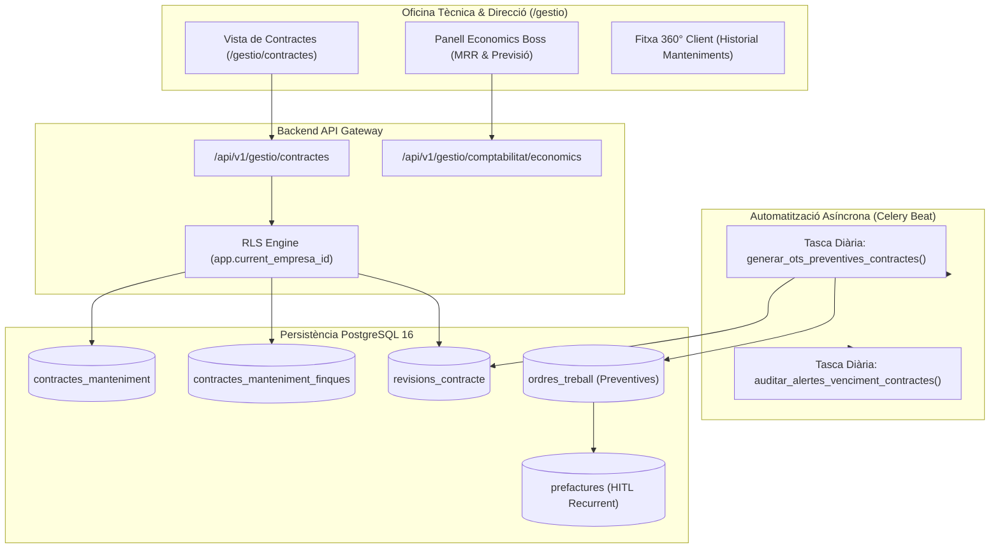

# Technical Plan: Contractes de Manteniment Recurrent (Spec 05)

**Feature Path**: `sevalor_AgentV2/specs/05-contractes-manteniment`  
**Status**: Planificat per a Desenvolupament (Sprint V2)  
**Especificació**: `sevalor_AgentV2/specs/05-contractes-manteniment/spec.md`  
**Stack Tècnic**: FastAPI (Python 3.12+), SQLAlchemy 2.0 (Async), PostgreSQL 16 amb RLS, Celery 5.3 + Celery Beat (cron de generació d'OTs), Next.js 14 (App Router).

---

## 1. Arquitectura del Mòdul i Flux Operatiu

El mòdul de **Contractes de Manteniment Recurrent** gestiona els acords de servei periòdic amb clients, automatitza la planificació preventiva i consolida els ingressos mensuals predictibles (MRR).

---

## 2. Esquema de Dades (Models ORM SQLAlchemy)

### 2.1 Model `ContracteManteniment`
- `id`: UUID (PK, default uuid4).
- `empresa_id`: UUID (FK `empreses.id`, RLS actiu).
- `client_id`: UUID (FK `clients.id`, cascada restrict).
- `codi_contracte`: String(30), UNIQUE per empresa (ex. `CONT-2026-001`).
- `titol`: String(200), no nul.
- `descripcio_serveis`: Text, detall dels serveis inclosos.
- `import_anual_pactat`: Numeric(12, 2), valor total de l'acord anual.
- `periodicitat`: String(20), valors permesos: `MENSUAL`, `TRIMESTRAL`, `SEMESTRAL`, `ANUAL`.
- `data_inici`: Date, data d'efecte del contracte.
- `data_fi`: Date, data de venciment natural.
- `estat`: String(20), valors: `ACTIU`, `SUSPES`, `FINALITZAT`, `BAIXA`.
- `renovacio_tacita`: Boolean, default True.
- `increment_renovacio_percent`: Numeric(5, 2), default 0.00.
- `motiu_baixa`: Text, nullable.
- `materials_inclosos`: Boolean, default False.
- `hores_boss_incloses`: Numeric(6, 2), default 0.00.
- `created_at` / `updated_at`: DateTime(timezone=True).

### 2.2 Model `ContracteMantenimentFinca` (Taula Associativa)
- `contracte_id`: UUID (FK `contractes_manteniment.id`, ondelete CASCADE).
- `finca_id`: UUID (FK `finques.id`, ondelete RESTRICT).
- `notes_especifiques`: Text, nullable.
- PK composta: (`contracte_id`, `finca_id`).

### 2.3 Model `RevisioContracte` (Registre del Calendari Preventiu)
- `id`: UUID (PK).
- `contracte_id`: UUID (FK `contractes_manteniment.id`).
- `finca_id`: UUID (FK `finques.id`).
- `data_planificada`: Date, data en què s'ha d'executar la revisió.
- `ordre_treball_id`: UUID (FK `ordres_treball.id`, nullable).
- `estat`: String(20), valors: `PROGRAMADA`, `OT_GENERADA`, `EXECUTADA`, `VENÇUDA`.
- `alerta_emesa_dies`: Integer (nullable: 15, 5, 1).

---

## 3. Endpoints de l'API REST (`/api/v1/gestio/contractes`)

| Mètode | Ruta | Descripció | Rol Mínim | Requisit Cobert |
| :--- | :--- | :--- | :--- | :--- |
| `GET` | `/gestio/contractes` | Llistat paginat de contractes amb filtre d'estat i cerca per client | `ENGINYER` | FR-001 |
| `POST` | `/gestio/contractes` | Alta d'un nou contracte amb finques associades i càlcul de calendari | `BOSS` | FR-001, FR-009 |
| `GET` | `/gestio/contractes/{id}` | Fitxa detallada del contracte amb historial de revisions i OTs | `ENGINYER` | FR-008 |
| `PUT` | `/gestio/contractes/{id}/renovar` | Renovació tàcita amb increment de preu (% o fix) i noves OTs | `BOSS` | FR-004 |
| `PUT` | `/gestio/contractes/{id}/baixa` | Registre de baixa amb motiu formal i cancel·lació d'OTs futures | `BOSS` | FR-005 |
| `GET` | `/gestio/contractes/kpis/mrr` | Mètrica agregada de MRR (`Suma(Contractes) / 12`) per a Economics | `BOSS` | FR-006 |
| `POST` | `/gestio/contractes/{id}/generar-ot` | Disparador manual per anticipar una OT preventiva | `ENGINYER` | FR-002 |

---

## 4. Tasques Asíncrones i Automatització (Celery Beat)

1. **`tasca_generar_ots_preventives` (Execució Diària a les 06:00 UTC)**:
   - Cerca totes les `revisions_contracte` amb `estat == 'PROGRAMADA'` i `data_planificada <= CURRENT_DATE + INTERVAL '15 days'`.
   - Crea automàticament l'`OrdreTreball` vinculant el client, la finca i la descripció del contracte.
   - Actualitza la revisió a `OT_GENERADA` associant l'`ordre_treball_id`.
   - *Cobertura*: FR-002.

2. **`tasca_auditar_alertes_venciment_contractes` (Execució Diària a les 07:00 UTC)**:
   - Identifica revisions a 15, 5 i 1 dia d'execució i contractes que vencen en els propers 30 dies.
   - Marca revisions no executades com a `VENÇUDA` i emet alertes visuals al Dashboard.
   - *Cobertura*: FR-003.

3. **Càlcul de Facturació Recurrent (HITL)**:
   - En culminar el període o executar la revisió, es genera una **Pre-factura** a la safata de comptabilitat. Cap factura definitiva s'emet sense validació humana (HITL).
   - *Cobertura*: FR-007.

---

## 5. Estratègia de Tests de la Feature

- **Test d'Alta i Càlcul de Revisions (`test_005_contractes_crud.py`)**:
  - Crear contracte trimestral -> Verificar que es generen exactament 4 registres de revisió programats a 3, 6, 9 i 12 mesos.
- **Test de Generació Automàtica d'OT (`test_005_contractes_celery.py`)**:
  - Executar la tasca de Celery -> Comprovar que l'OT preventiva es crea amb les adreces i materials de la finca.
- **Test de Renovació amb Increment (`test_005_contractes_renovacio.py`)**:
  - Renovar amb un 5% d'increment -> Verificar que el nou import anual reflecteix l'augment i que el MRR s'actualitza correctament.
- **Test de Segregació de Rols (`test_005_contractes_rbac.py`)**:
  - Intentar consultar el MRR com a `OPERARI` o `ENGINYER` -> Rebutjat amb **HTTP 403 Forbidden**.
